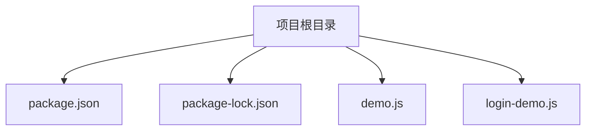
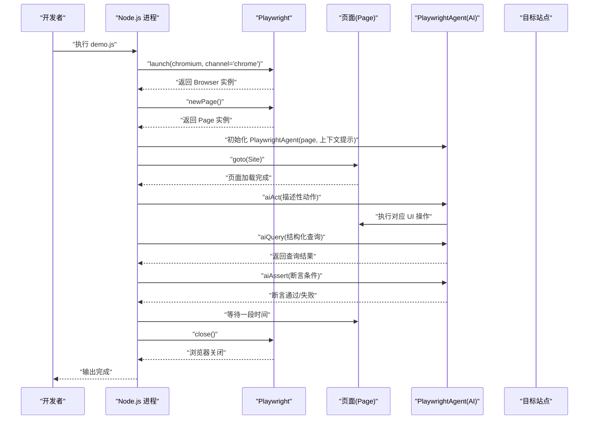
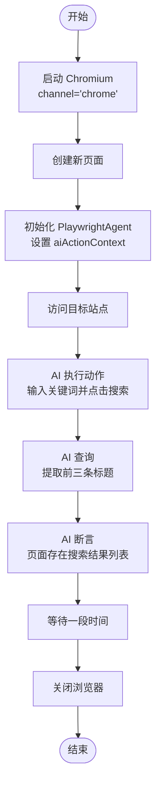
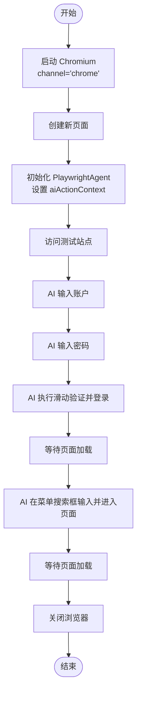
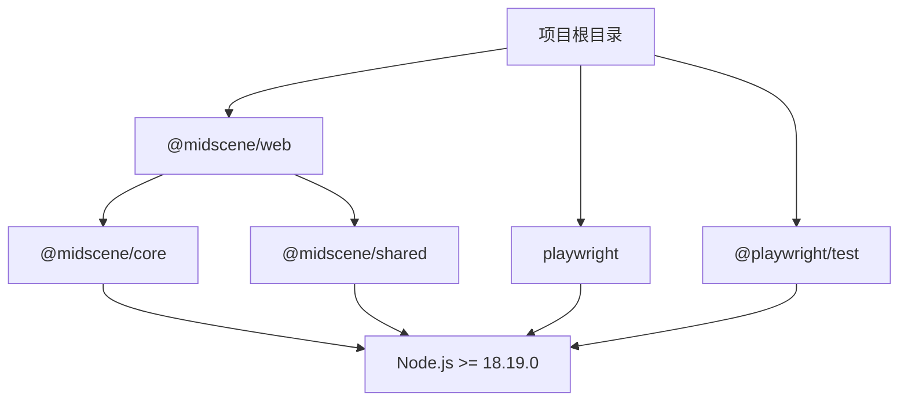

# 快速开始

<cite>
**本文引用的文件**
- [package.json](file://package.json)
- [package-lock.json](file://package-lock.json)
- [demo.js](file://demo.js)
- [login-demo.js](file://login-demo.js)
- [@midscene/web 说明](file://node_modules/@midscene/web/README.md)
- [@midscene/core 说明](file://node_modules/@midscene/core/README.md)
</cite>

## 目录
1. [简介](#简介)
2. [项目结构](#项目结构)
3. [核心组件](#核心组件)
4. [架构总览](#架构总览)
5. [详细组件分析](#详细组件分析)
6. [依赖关系分析](#依赖关系分析)
7. [性能注意事项](#性能注意事项)
8. [故障排除指南](#故障排除指南)
9. [结论](#结论)
10. [附录](#附录)

## 简介
本指南面向首次接触 Midscene.js Web Demo 的开发者，帮助你在约 30 分钟内完成环境准备、依赖安装与首次自动化示例运行（百度搜索与登录演示）。你将学会：
- 准备 Node.js 与浏览器环境
- 安装项目依赖并验证
- 运行 demo.js 进行百度搜索自动化
- 运行 login-demo.js 完成登录与导航流程
- 常见问题排查与调试技巧

## 项目结构
该项目为最小可运行示例，包含以下关键文件：
- package.json：定义依赖与项目元信息
- package-lock.json：锁定依赖版本
- demo.js：使用本地 Chrome 打开百度并进行搜索、提取与断言
- login-demo.js：打开测试站点，完成账号密码输入、滑动验证、菜单搜索与导航

图表来源
- [package.json:1-18](file://package.json#L1-L18)
- [package-lock.json:1-20](file://package-lock.json#L1-L20)
- [demo.js:1-45](file://demo.js#L1-L45)
- [login-demo.js:1-53](file://login-demo.js#L1-L53)

章节来源
- [package.json:1-18](file://package.json#L1-L18)
- [package-lock.json:1-20](file://package-lock.json#L1-L20)

## 核心组件
- 运行时与浏览器驱动
  - Node.js 版本要求：根据依赖声明，Node.js 需要满足最低版本要求（详见“依赖关系分析”）
  - 浏览器：使用 Chromium（channel: 'chrome'），需系统已安装 Chrome 或可由 Playwright 启动
- 自动化核心
  - @midscene/web：提供 PlaywrightAgent，支持 aiAct、aiQuery、aiAssert 等 AI 驱动的自动化能力
  - Playwright：负责浏览器实例管理与页面操作
- 示例脚本
  - demo.js：打开百度首页，输入关键词并提取前三条标题，断言存在搜索结果列表
  - login-demo.js：打开测试站点，模拟账号密码输入、滑动验证、菜单搜索与导航

章节来源
- [demo.js:1-45](file://demo.js#L1-L45)
- [login-demo.js:1-53](file://login-demo.js#L1-L53)
- [@midscene/web 说明:1-8](file://node_modules/@midscene/web/README.md#L1-L8)
- [@midscene/core 说明:1-9](file://node_modules/@midscene/core/README.md#L1-L9)

## 架构总览
下图展示了 demo.js 的端到端执行流程：启动浏览器 → 创建页面 → 初始化 AI Agent → 访问目标站点 → AI 执行动作 → 提取数据 → 断言 → 关闭浏览器。

图表来源
- [demo.js:7-44](file://demo.js#L7-L44)

## 详细组件分析

### demo.js 组件分析
- 功能概述
  - 启动本地 Chrome（非无头模式）
  - 打开百度首页
  - 使用 AI 动作在搜索框输入关键词并点击搜索
  - 使用 AI 查询提取前三条搜索标题
  - 使用 AI 断言页面存在搜索结果列表
  - 最后关闭浏览器并输出完成信息
- 关键调用链
  - 启动浏览器与页面：chromium.launch(channel='chrome') → newPage()
  - 初始化 AI Agent：new PlaywrightAgent(page, { aiActionContext })
  - 页面交互：agent.aiAct(...)、agent.aiQuery(...)、agent.aiAssert(...)
  - 资源清理：page.waitForTimeout(...) → browser.close()

图表来源
- [demo.js:7-44](file://demo.js#L7-L44)

章节来源
- [demo.js:1-45](file://demo.js#L1-L45)

### login-demo.js 组件分析
- 功能概述
  - 启动本地 Chrome（非无头模式）
  - 打开测试站点，输入账户与密码
  - 完成滑动验证并登录
  - 在左侧菜单搜索“返利订单查询”，进入对应页面
  - 输出完成信息并关闭浏览器
- 关键调用链
  - 启动浏览器与页面：chromium.launch(channel='chrome') → newPage()
  - 初始化 AI Agent：new PlaywrightAgent(page, { aiActionContext })
  - 页面交互：agent.aiAct(...) 用于输入与滑动验证
  - 资源清理：page.waitForTimeout(...) → browser.close()

图表来源
- [login-demo.js:7-52](file://login-demo.js#L7-L52)

章节来源
- [login-demo.js:1-53](file://login-demo.js#L1-L53)

## 依赖关系分析
- Node.js 版本要求
  - @midscene/web 与 @midscene/core 均声明需要 Node.js >= 18.19.0
  - @playwright/test 与 puppeteer-core 声明 Node.js >= 18
  - 因此建议使用 Node.js 18.19.0 或更高版本
- 关键依赖
  - @midscene/web：提供 AI 驱动的浏览器自动化能力（Playwright 集成）
  - playwright：浏览器自动化驱动
  - @playwright/test：Playwright 测试工具（可选，便于测试与调试）

图表来源
- [package.json:12-16](file://package.json#L12-L16)
- [package-lock.json:492-585](file://package-lock.json#L492-L585)

章节来源
- [package.json:12-16](file://package.json#L12-L16)
- [package-lock.json:492-585](file://package-lock.json#L492-L585)

## 性能注意事项
- 非无头模式运行会占用更多系统资源，适合学习与调试；生产场景建议使用无头模式以提升吞吐量
- 页面等待策略：示例中使用固定等待时间，实际项目建议结合元素可见性或网络空闲状态进行更稳健的等待
- AI 动作与查询：尽量使用明确的自然语言描述，避免歧义导致重复尝试

## 故障排除指南
- Node.js 版本不满足要求
  - 现象：安装或运行时报 Node 版本过低
  - 处理：升级 Node.js 至 18.19.0 或更高版本
- 未安装 Chrome 或无法启动 Chromium
  - 现象：启动浏览器时报错，找不到 Chrome
  - 处理：确保系统已安装 Chrome；或使用 Playwright 内置的浏览器下载功能（首次运行时自动下载）
- 权限或代理问题
  - 现象：网络请求失败或超时
  - 处理：检查系统代理设置；必要时配置 HTTP/HTTPS 代理或使用 SOCKS 代理
- 页面元素定位不稳定
  - 现象：AI 动作无法找到输入框或按钮
  - 处理：在 aiActionContext 中提供更清晰的上下文提示；适当增加等待时间；优先使用稳定的选择器或可访问性标签
- 断言失败
  - 现象：aiAssert 报告断言不成立
  - 处理：调整断言条件；确认页面已完全加载；检查目标元素是否动态渲染

章节来源
- [demo.js:37-43](file://demo.js#L37-L43)
- [login-demo.js:44-51](file://login-demo.js#L44-L51)

## 结论
通过本指南，你已经完成了环境准备、依赖安装与两个核心示例的运行。建议在掌握基础后，逐步优化页面等待策略、增强断言健壮性，并探索更多 AI 驱动的自动化场景。

## 附录

### 环境要求与准备
- Node.js：建议使用 18.19.0 或更高版本
- 浏览器：Chrome（推荐）或可由 Playwright 启动的 Chromium
- 网络：可访问目标站点（百度、测试站点）

章节来源
- [package-lock.json:492-585](file://package-lock.json#L492-L585)

### 安装与验证步骤
- 步骤 1：安装依赖
  - 在项目根目录执行安装命令（例如使用 npm）
  - 参考路径：[package.json:12-16](file://package.json#L12-L16)
- 步骤 2：验证安装
  - 确认 node_modules 已生成且 package-lock.json 与 package.json 一致
  - 参考路径：[package-lock.json:1-20](file://package-lock.json#L1-L20)

章节来源
- [package.json:12-16](file://package.json#L12-L16)
- [package-lock.json:1-20](file://package-lock.json#L1-L20)

### 运行第一个演示脚本：demo.js
- 步骤 1：启动脚本
  - 在项目根目录执行脚本
  - 参考路径：[demo.js:7-44](file://demo.js#L7-L44)
- 步骤 2：观察输出
  - 控制台会依次打印启动、打开站点、AI 执行、查询与断言等日志
  - 参考路径：[demo.js:20-35](file://demo.js#L20-L35)
- 步骤 3：验证结果
  - 确认输出包含前三条标题与断言通过信息
  - 参考路径：[demo.js:28-35](file://demo.js#L28-L35)

章节来源
- [demo.js:7-44](file://demo.js#L7-L44)

### 运行登录演示：login-demo.js
- 步骤 1：启动脚本
  - 在项目根目录执行脚本
  - 参考路径：[login-demo.js:7-52](file://login-demo.js#L7-L52)
- 步骤 2：观察输出
  - 控制台会依次打印打开站点、输入账户/密码、滑动验证、菜单搜索与导航等日志
  - 参考路径：[login-demo.js:20-42](file://login-demo.js#L20-L42)
- 步骤 3：验证结果
  - 确认最终输出“登录和导航完成！”以及浏览器关闭信息
  - 参考路径：[login-demo.js:42-51](file://login-demo.js#L42-L51)

章节来源
- [login-demo.js:7-52](file://login-demo.js#L7-L52)

### 常见问题排查清单
- Node.js 版本过低
  - 现象：安装或运行报错
  - 处理：升级至 18.19.0 或更高版本
- 无法启动浏览器
  - 现象：找不到 Chrome 或启动失败
  - 处理：安装 Chrome 或允许 Playwright 下载浏览器
- 网络受限
  - 现象：访问目标站点失败
  - 处理：配置代理或更换网络
- 元素定位失败
  - 现象：AI 动作找不到目标元素
  - 处理：优化动作描述、增加等待、使用稳定选择器
- 断言失败
  - 现象：aiAssert 报错
  - 处理：调整断言条件、确认页面加载完成

章节来源
- [demo.js:37-43](file://demo.js#L37-L43)
- [login-demo.js:44-51](file://login-demo.js#L44-L51)

### 调试技巧
- 使用非无头模式运行，便于观察页面变化
- 在 aiActionContext 中提供更清晰的上下文提示
- 对关键步骤添加等待与重试逻辑
- 将查询结果与断言结果打印到日志，便于定位问题