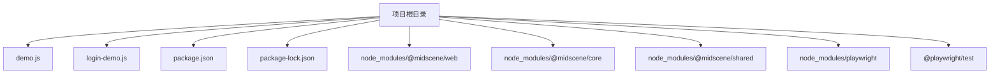
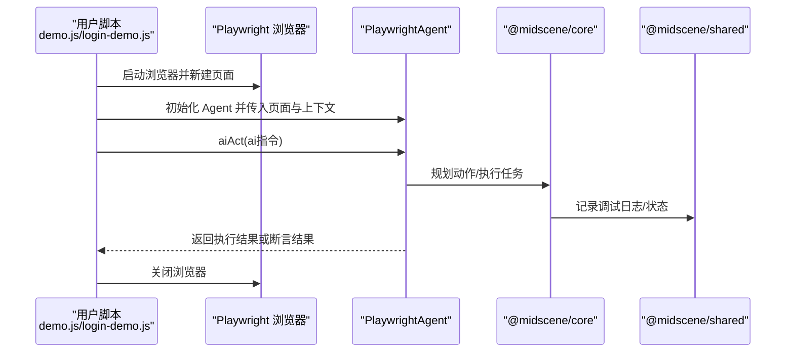
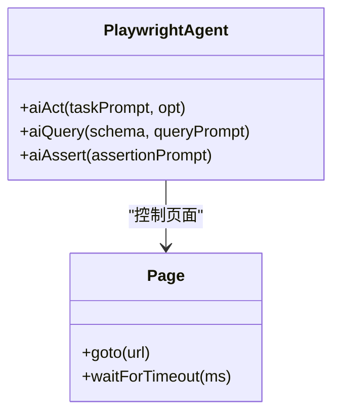
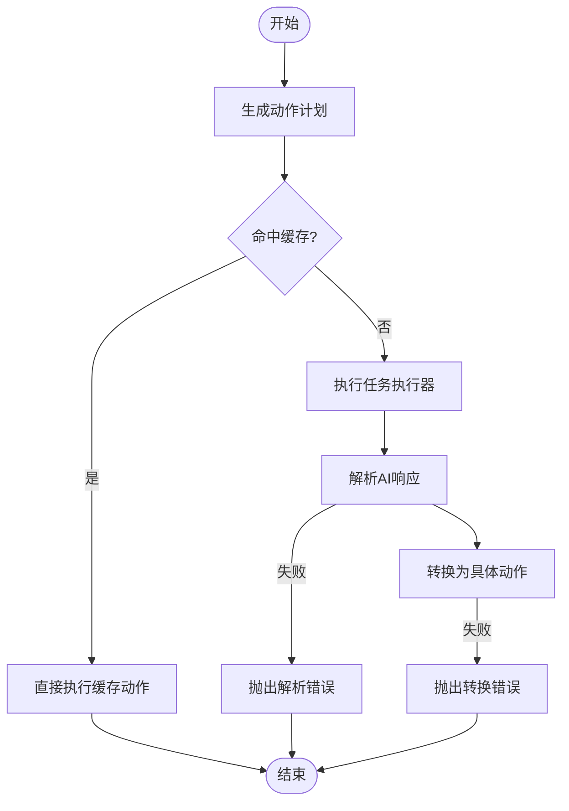
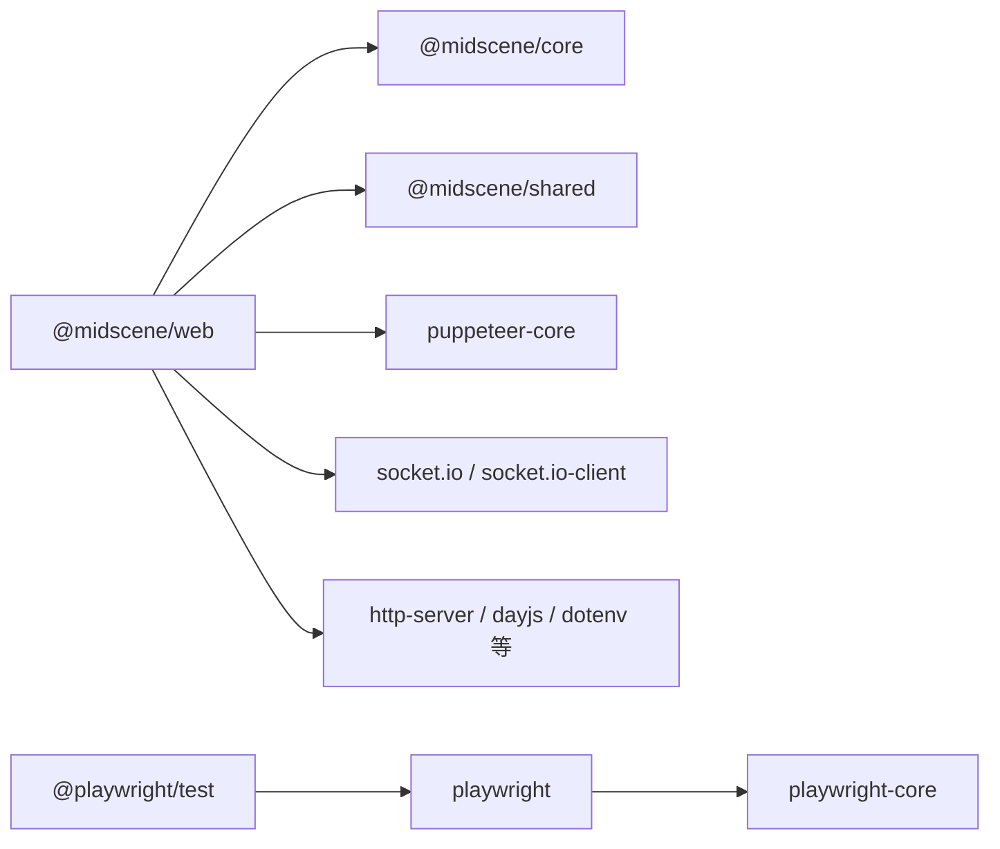

# 故障排查与调试

<cite>
**本文引用的文件**
- [package.json](file://package.json)
- [package-lock.json](file://package-lock.json)
- [demo.js](file://demo.js)
- [login-demo.js](file://login-demo.js)
- [@midscene/web README.md](file://node_modules/@midscene/web/README.md)
- [@midscene/core README.md](file://node_modules/@midscene/core/README.md)
- [@midscene/shared README.md](file://node_modules/@midscene/shared/README.md)
- [agent.js（@midscene/core）](file://node_modules/@midscene/core/dist/lib/agent/agent.js)
- [task-builder.js（@midscene/core）](file://node_modules/@midscene/core/dist/lib/agent/task-builder.js)
- [tasks.js（@midscene/core）](file://node_modules/@midscene/core/dist/lib/agent/tasks.js)
- [parser.js（@midscene/core）](file://node_modules/@midscene/core/dist/lib/ai-model/auto-glm/parser.js)
- [actions.js（@midscene/core）](file://node_modules/@midscene/core/dist/lib/ai-model/auto-glm/actions.js)
</cite>

## 目录
1. [简介](#简介)
2. [项目结构](#项目结构)
3. [核心组件](#核心组件)
4. [架构总览](#架构总览)
5. [详细组件分析](#详细组件分析)
6. [依赖关系分析](#依赖关系分析)
7. [性能考虑](#性能考虑)
8. [故障排查指南](#故障排查指南)
9. [结论](#结论)
10. [附录](#附录)

## 简介
本指南面向使用 Midscene Web 的开发者，聚焦于常见AI自动化问题的故障排查与调试。内容涵盖：
- 如何分析 agent.log 日志与 Playwright 测试报告
- 常见错误类型：页面元素定位失败、AI指令解析错误、浏览器兼容性问题
- 调试工具使用方法与最佳实践
- 性能问题识别与优化建议
- 错误代码对照表与快速解决方案索引
- 社区支持与问题反馈渠道

## 项目结构
该项目为一个最小可运行示例，包含两个演示脚本与依赖声明：
- demo.js：演示基础搜索与断言流程
- login-demo.js：演示登录与菜单导航流程
- package.json/package-lock.json：定义依赖与版本锁定

图表来源
- [package.json:1-17](file://package.json#L1-L17)
- [package-lock.json:547-585](file://package-lock.json#L547-L585)
- [demo.js:1-45](file://demo.js#L1-L45)
- [login-demo.js:1-53](file://login-demo.js#L1-L53)

章节来源
- [package.json:1-17](file://package.json#L1-L17)
- [package-lock.json:547-585](file://package-lock.json#L547-L585)
- [demo.js:1-45](file://demo.js#L1-L45)
- [login-demo.js:1-53](file://login-demo.js#L1-L53)

## 核心组件
- PlaywrightAgent：封装对页面的操作、数据提取与断言的AI代理
- Playwright 浏览器实例：负责页面生命周期与交互
- Midscene Web 核心模块：提供AI动作规划、任务执行、日志与错误处理能力

章节来源
- [demo.js:4-18](file://demo.js#L4-L18)
- [login-demo.js:4-18](file://login-demo.js#L4-L18)
- [package.json:12-16](file://package.json#L12-L16)
- [@midscene/web README.md:1-8](file://node_modules/@midscene/web/README.md#L1-L8)

## 架构总览
下图展示从脚本到浏览器再到AI引擎的整体调用链路。

图表来源
- [demo.js:7-44](file://demo.js#L7-L44)
- [login-demo.js:7-52](file://login-demo.js#L7-L52)
- [agent.js（@midscene/core）:380-408](file://node_modules/@midscene/core/dist/lib/agent/agent.js#L380-L408)

## 详细组件分析

### 组件一：PlaywrightAgent 与页面交互
- 初始化：传入 page 实例与 aiActionContext 上下文
- aiAct：将自然语言指令转换为具体页面动作
- aiQuery：从页面抽取结构化数据
- aiAssert：基于自然语言断言页面状态

图表来源
- [demo.js:16-35](file://demo.js#L16-L35)
- [login-demo.js:16-42](file://login-demo.js#L16-L42)

章节来源
- [demo.js:16-35](file://demo.js#L16-L35)
- [login-demo.js:16-42](file://login-demo.js#L16-L42)

### 组件二：AI 动作规划与执行（@midscene/core）
- 动作缓存与重试机制
- 任务构建与参数校验
- 解析器与动作转换器
- 调试日志输出与错误包装

图表来源
- [agent.js（@midscene/core）:380-408](file://node_modules/@midscene/core/dist/lib/agent/agent.js#L380-L408)
- [parser.js（@midscene/core）:197-199](file://node_modules/@midscene/core/dist/lib/ai-model/auto-glm/parser.js#L197-L199)
- [actions.js（@midscene/core）:258-261](file://node_modules/@midscene/core/dist/lib/ai-model/auto-glm/actions.js#L258-L261)

章节来源
- [agent.js（@midscene/core）:138-167](file://node_modules/@midscene/core/dist/lib/agent/agent.js#L138-L167)
- [task-builder.js（@midscene/core）:156-168](file://node_modules/@midscene/core/dist/lib/agent/task-builder.js#L156-L168)
- [tasks.js（@midscene/core）:236-244](file://node_modules/@midscene/core/dist/lib/agent/tasks.js#L236-L244)
- [parser.js（@midscene/core）:197-199](file://node_modules/@midscene/core/dist/lib/ai-model/auto-glm/parser.js#L197-L199)
- [actions.js（@midscene/core）:258-261](file://node_modules/@midscene/core/dist/lib/ai-model/auto-glm/actions.js#L258-L261)

### 组件三：日志与调试（@midscene/shared）
- 使用命名空间 logger 输出 agent 调试信息
- 在关键路径打印调试日志，便于定位问题

章节来源
- [agent.js（@midscene/core）:51-68](file://node_modules/@midscene/core/dist/lib/agent/agent.js#L51-L68)

## 依赖关系分析
- @midscene/web 依赖 @midscene/core、@midscene/shared、puppeteer-core、socket.io 等
- @playwright/test 与 playwright 作为测试与浏览器驱动
- Node 版本要求与 peerDependencies 兼容性需满足

图表来源
- [package-lock.json:547-585](file://package-lock.json#L547-L585)
- [package.json:12-16](file://package.json#L12-L16)

章节来源
- [package.json:12-16](file://package.json#L12-L16)
- [package-lock.json:547-585](file://package-lock.json#L547-L585)

## 性能考虑
- 页面等待策略：使用 waitForTimeout 控制时机，但应优先采用更精确的等待条件以减少超时时间
- 动作缓存：合理利用缓存可降低重复规划成本
- 日志级别：在开发阶段开启详细日志，在生产环境适当降低日志量以减少 I/O 开销
- 浏览器通道：使用系统 Chrome 可提升稳定性，但需确保版本兼容

章节来源
- [demo.js:39-42](file://demo.js#L39-L42)
- [login-demo.js:47-50](file://login-demo.js#L47-L50)
- [agent.js（@midscene/core）:138-167](file://node_modules/@midscene/core/dist/lib/agent/agent.js#L138-L167)

## 故障排查指南

### 一、日志分析与定位
- 日志来源：agent 调试日志由 @midscene/shared 提供，关键路径会输出调试信息
- 分析要点：
  - 动作规划阶段是否成功生成计划
  - 是否命中缓存，缓存是否过期
  - 解析与转换环节是否报错
  - 重试机制是否触发及原因

章节来源
- [agent.js（@midscene/core）:51-68](file://node_modules/@midscene/core/dist/lib/agent/agent.js#L51-L68)
- [agent.js（@midscene/core）:138-167](file://node_modules/@midscene/core/dist/lib/agent/agent.js#L138-L167)

### 二、Playwright 测试报告
- 项目中包含 @playwright/test 依赖，可用于编写正式测试并生成报告
- 建议：
  - 将 demo.js/login-demo.js 改写为标准测试用例
  - 配置截图/视频录制与报告导出，便于回溯失败场景
  - 使用断言与页面等待替代硬编码等待

章节来源
- [package.json:12-16](file://package.json#L12-L16)

### 三、常见错误类型与诊断

#### 1. 页面元素定位失败
- 症状：aiAct 报错或页面无响应
- 排查步骤：
  - 确认页面已正确跳转且元素可见
  - 检查选择器是否稳定，优先使用语义化属性
  - 增加等待策略（如等待容器出现），避免过早操作
  - 查看 agent 调试日志中的动作计划与缓存命中情况
- 相关实现参考：
  - 动作执行与缓存逻辑
  - 任务构建与参数校验

章节来源
- [agent.js（@midscene/core）:380-408](file://node_modules/@midscene/core/dist/lib/agent/agent.js#L380-L408)
- [task-builder.js（@midscene/core）:156-168](file://node_modules/@midscene/core/dist/lib/agent/task-builder.js#L156-L168)

#### 2. AI 指令解析错误
- 症状：解析器抛出“解析失败”错误
- 排查步骤：
  - 简化自然语言指令，明确目标与顺序
  - 检查返回格式是否符合期望 schema
  - 查看解析器错误消息中的原始响应片段
- 相关实现参考：
  - 解析器错误包装
  - 动作转换器错误包装

章节来源
- [parser.js（@midscene/core）:197-199](file://node_modules/@midscene/core/dist/lib/ai-model/auto-glm/parser.js#L197-L199)
- [actions.js（@midscene/core）:258-261](file://node_modules/@midscene/core/dist/lib/ai-model/auto-glm/actions.js#L258-L261)

#### 3. 浏览器兼容性问题
- 症状：页面行为异常、元素不可交互、截图/视频录制失败
- 排查步骤：
  - 确认 Node 版本满足 @midscene/web 与 @playwright/test 的最低要求
  - 使用系统 Chrome（channel: 'chrome'）并确保版本匹配
  - 检查 puppeteer-core 与 devtools 协议的兼容性
- 相关实现参考：
  - @midscene/web 引擎与 peerDependencies
  - playwright 与 playwright-core 版本

章节来源
- [package.json:12-16](file://package.json#L12-L16)
- [package-lock.json:547-585](file://package-lock.json#L547-L585)
- [package-lock.json:2801-2830](file://package-lock.json#L2801-L2830)

### 四、调试工具与最佳实践
- 调试工具：
  - 启用 headless:false 以便观察页面行为
  - 使用截图/视频录制辅助定位问题
  - 在关键节点增加日志输出与断点
- 最佳实践：
  - 将复杂流程拆分为多个小步骤，分别断言
  - 使用稳定的上下文提示（aiActionContext）提升理解一致性
  - 对易变元素使用更鲁棒的选择策略

章节来源
- [demo.js:10-13](file://demo.js#L10-L13)
- [login-demo.js:10-13](file://login-demo.js#L10-L13)
- [demo.js:16-18](file://demo.js#L16-L18)
- [login-demo.js:16-18](file://login-demo.js#L16-L18)

### 五、性能问题识别与优化
- 识别指标：
  - 动作规划耗时、AI解析耗时、页面等待耗时
  - 日志中重试次数与延迟
- 优化建议：
  - 合理使用缓存，减少重复规划
  - 替代硬编码等待为条件等待
  - 降低日志级别或按需输出

章节来源
- [agent.js（@midscene/core）:138-167](file://node_modules/@midscene/core/dist/lib/agent/agent.js#L138-L167)

### 六、错误代码对照表与快速索引
- 错误类型与定位入口
  - 解析失败：查看解析器错误包装
    - [parser.js（@midscene/core）:197-199](file://node_modules/@midscene/core/dist/lib/ai-model/auto-glm/parser.js#L197-L199)
  - 转换失败：查看动作转换器错误包装
    - [actions.js（@midscene/core）:258-261](file://node_modules/@midscene/core/dist/lib/ai-model/auto-glm/actions.js#L258-L261)
  - 参数校验失败：查看任务构建器错误包装
    - [task-builder.js（@midscene/core）:156-168](file://node_modules/@midscene/core/dist/lib/agent/task-builder.js#L156-L168)
  - 任务执行异常：查看任务执行器相关错误
    - [tasks.js（@midscene/core）:236-244](file://node_modules/@midscene/core/dist/lib/agent/tasks.js#L236-L244)

### 七、社区支持与问题反馈
- 官方文档与集成指南
  - Midscene Web 文档与 Playwright/Puppeteer 集成说明
    - [@midscene/web README.md:1-8](file://node_modules/@midscene/web/README.md#L1-L8)
  - Midscene Core 与 Shared 概述
    - [@midscene/core README.md:1-9](file://node_modules/@midscene/core/README.md#L1-L9)
    - [@midscene/shared README.md:1-9](file://node_modules/@midscene/shared/README.md#L1-L9)

章节来源
- [@midscene/web README.md:1-8](file://node_modules/@midscene/web/README.md#L1-L8)
- [@midscene/core README.md:1-9](file://node_modules/@midscene/core/README.md#L1-L9)
- [@midscene/shared README.md:1-9](file://node_modules/@midscene/shared/README.md#L1-L9)

## 结论
通过结合 agent 调试日志、AI解析与动作转换器的错误包装、以及 Playwright 的测试与录制能力，可以系统性地定位与解决AI自动化过程中的常见问题。建议在开发阶段充分利用日志与截图/视频，逐步将演示脚本迁移为正式测试用例，并持续优化动作缓存与等待策略以提升稳定性与性能。

## 附录

### A. 快速检查清单
- 页面是否正确加载且元素可见
- 自然语言指令是否清晰、可执行
- 是否存在缓存命中与重试
- 日志中是否出现解析/转换错误
- Node 与浏览器版本是否满足依赖要求

### B. 参考实现路径
- Agent 初始化与上下文设置
  - [demo.js:16-18](file://demo.js#L16-L18)
  - [login-demo.js:16-18](file://login-demo.js#L16-L18)
- 动作执行与缓存
  - [agent.js（@midscene/core）:380-408](file://node_modules/@midscene/core/dist/lib/agent/agent.js#L380-L408)
- 解析与转换错误
  - [parser.js（@midscene/core）:197-199](file://node_modules/@midscene/core/dist/lib/ai-model/auto-glm/parser.js#L197-L199)
  - [actions.js（@midscene/core）:258-261](file://node_modules/@midscene/core/dist/lib/ai-model/auto-glm/actions.js#L258-L261)
- 任务构建与参数校验
  - [task-builder.js（@midscene/core）:156-168](file://node_modules/@midscene/core/dist/lib/agent/task-builder.js#L156-L168)
- 依赖与版本
  - [package.json:12-16](file://package.json#L12-L16)
  - [package-lock.json:547-585](file://package-lock.json#L547-L585)
  - [package-lock.json:2801-2830](file://package-lock.json#L2801-L2830)