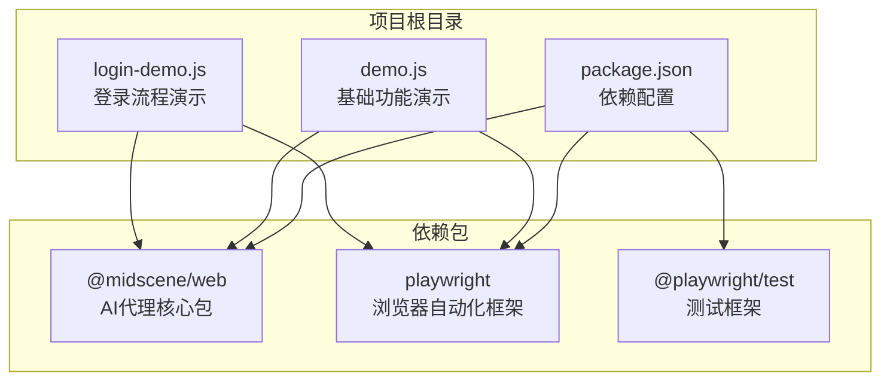
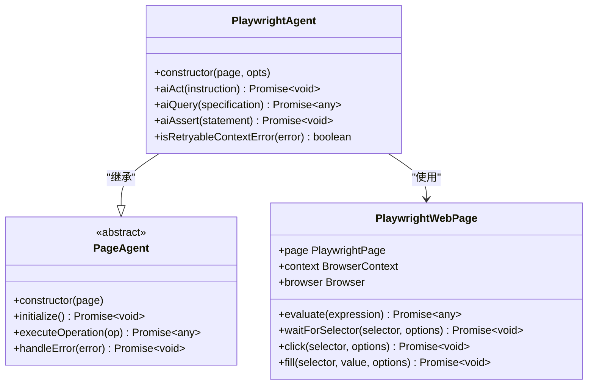
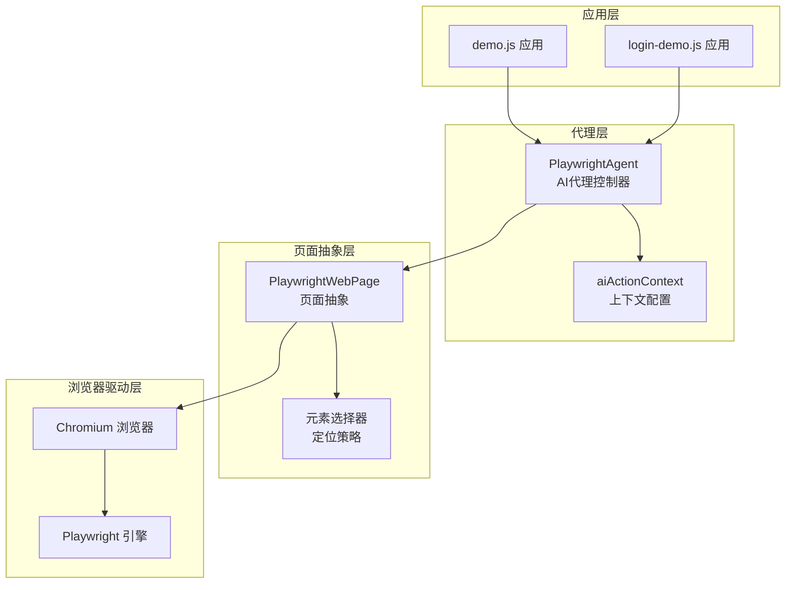
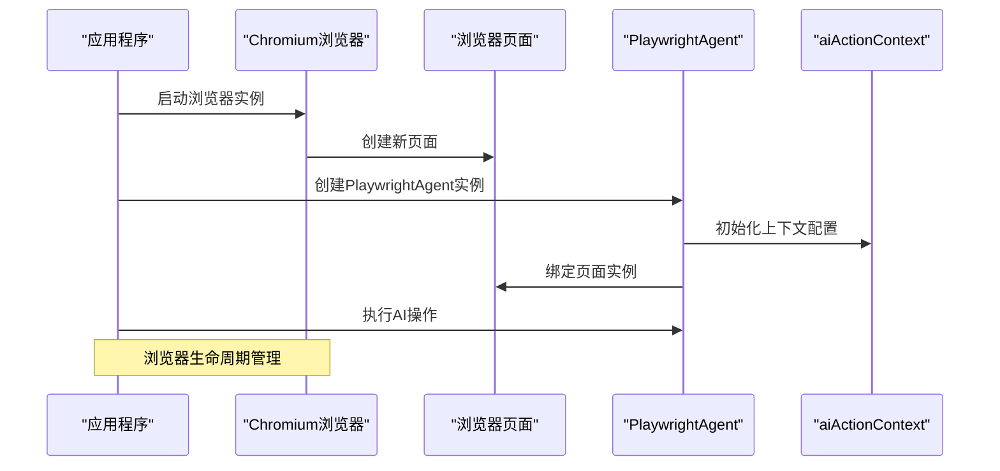
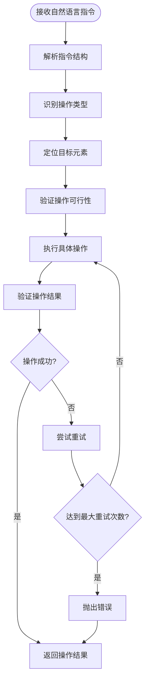
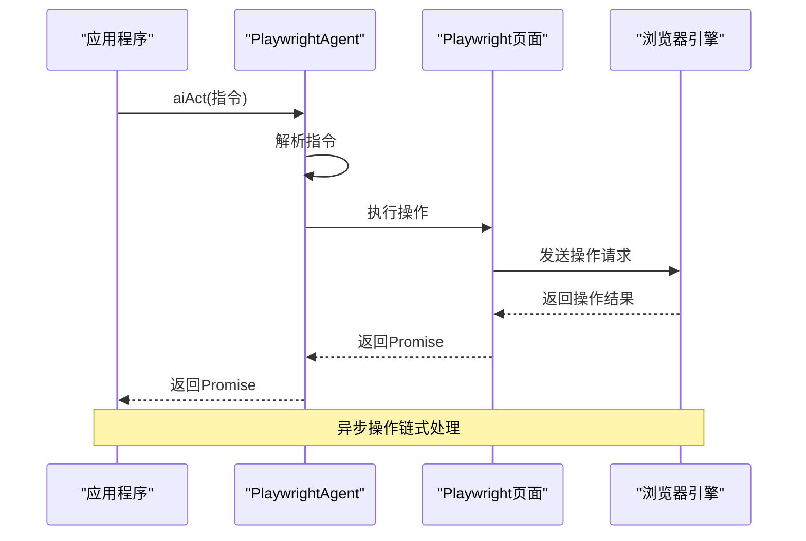
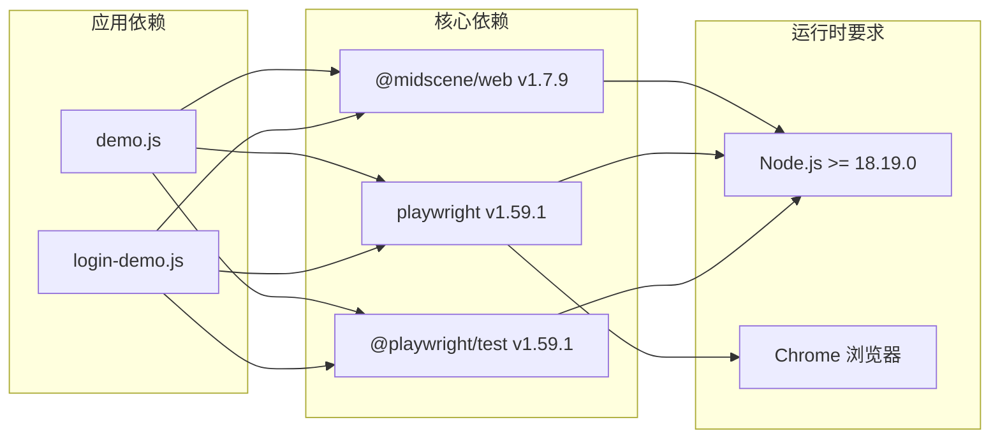
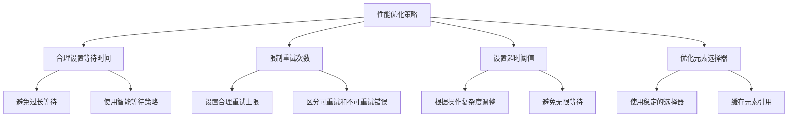

# AI代理工作原理

<cite>
**本文档引用的文件**
- [demo.js](file://demo.js)
- [login-demo.js](file://login-demo.js)
- [package.json](file://package.json)
- [node_modules/@midscene/web/dist/types/playwright/index.d.ts](file://node_modules/@midscene/web/dist/types/playwright/index.d.ts)
</cite>

## 目录
1. [简介](#简介)
2. [项目结构](#项目结构)
3. [核心组件](#核心组件)
4. [架构概览](#架构概览)
5. [详细组件分析](#详细组件分析)
6. [依赖关系分析](#依赖关系分析)
7. [性能考虑](#性能考虑)
8. [故障排除指南](#故障排除指南)
9. [结论](#结论)

## 简介

本项目展示了AI代理在浏览器自动化中的应用，通过PlaywrightAgent类实现了智能的网页操作能力。该系统允许开发者使用自然语言指令控制浏览器执行复杂的自动化任务，包括表单填写、页面导航、数据提取和断言验证等操作。

AI代理的核心价值在于将人类的自然语言描述转换为精确的浏览器操作序列，大大降低了网页自动化的技术门槛。通过集成@midscene/web包，系统提供了完整的AI驱动的浏览器自动化解决方案。

## 项目结构

该项目采用简洁的结构设计，主要包含两个演示脚本和必要的依赖配置：

**图表来源**
- [package.json:1-18](file://package.json#L1-L18)
- [demo.js:1-45](file://demo.js#L1-L45)
- [login-demo.js:1-53](file://login-demo.js#L1-L53)

**章节来源**
- [package.json:1-18](file://package.json#L1-L18)
- [demo.js:1-45](file://demo.js#L1-L45)
- [login-demo.js:1-53](file://login-demo.js#L1-L53)

## 核心组件

### PlaywrightAgent类

PlaywrightAgent是整个系统的核心组件，继承自PageAgent基类，专门用于Playwright浏览器环境的AI代理操作。

**图表来源**
- [node_modules/@midscene/web/dist/types/playwright/index.d.ts:10-13](file://node_modules/@midscene/web/dist/types/playwright/index.d.ts#L10-L13)

### AI操作接口

系统提供了三个核心的AI操作接口，每个都针对不同的自动化需求：

1. **aiAct**: 执行浏览器操作指令
2. **aiQuery**: 提取页面数据信息  
3. **aiAssert**: 验证页面状态

**章节来源**
- [node_modules/@midscene/web/dist/types/playwright/index.d.ts:10-13](file://node_modules/@midscene/web/dist/types/playwright/index.d.ts#L10-L13)

## 架构概览

系统采用分层架构设计，从上到下分为应用层、代理层、页面抽象层和浏览器驱动层：

**图表来源**
- [demo.js:16-18](file://demo.js#L16-L18)
- [login-demo.js:16-18](file://login-demo.js#L16-L18)

## 详细组件分析

### PlaywrightAgent初始化流程

系统通过以下步骤初始化PlaywrightAgent实例：

**图表来源**
- [demo.js:10-18](file://demo.js#L10-L18)
- [login-demo.js:10-18](file://login-demo.js#L10-L18)

### aiActionContext配置详解

aiActionContext是AI代理的核心配置参数，它定义了代理的操作背景和约束条件：

| 配置项 | 类型 | 必需 | 描述 |
|--------|------|------|------|
| aiActionContext | string | 是 | 定义代理操作场景的上下文描述 |
| timeout | number | 否 | 操作超时时间（毫秒） |
| retryCount | number | 否 | 重试次数限制 |
| selectorStrategy | string | 否 | 元素选择器策略 |

**章节来源**
- [demo.js:16-18](file://demo.js#L16-L18)
- [login-demo.js:16-18](file://login-demo.js#L16-L18)

### 自然语言到浏览器操作的转换过程

系统通过以下流程将自然语言指令转换为具体的浏览器操作：

**图表来源**
- [demo.js:24-35](file://demo.js#L24-L35)
- [login-demo.js:24-42](file://login-demo.js#L24-L42)

### 异步操作处理机制

系统采用Promise链式调用处理异步操作，确保操作的顺序性和可靠性：

**图表来源**
- [demo.js:24-35](file://demo.js#L24-L35)
- [login-demo.js:24-42](file://login-demo.js#L24-L42)

**章节来源**
- [demo.js:20-43](file://demo.js#L20-L43)
- [login-demo.js:20-51](file://login-demo.js#L20-L51)

## 依赖关系分析

### 核心依赖关系

系统依赖关系清晰明确，主要依赖于@midscene/web和playwright两个核心包：

**图表来源**
- [package.json:12-16](file://package.json#L12-L16)
- [package.json:547-584](file://package.json#L547-L584)

### 版本兼容性

系统对Node.js版本有严格要求，需要满足以下条件：
- Node.js >= 18.19.0
- @midscene/web ^1.7.9
- playwright ^1.59.1
- @playwright/test ^1.59.1

**章节来源**
- [package.json:12-16](file://package.json#L12-L16)
- [package.json:547-584](file://package.json#L547-L584)

## 性能考虑

### 浏览器资源管理

系统在浏览器生命周期管理方面采用了最佳实践：

1. **延迟启动**: 只在需要时启动浏览器实例
2. **及时释放**: 操作完成后立即关闭浏览器连接
3. **内存优化**: 合理管理页面对象的生命周期

### 操作优化策略

## 故障排除指南

### 常见错误类型及处理

| 错误类型 | 触发原因 | 处理建议 |
|----------|----------|----------|
| 上下文错误 | 页面状态异常或元素不存在 | 检查aiActionContext配置，增加重试机制 |
| 超时错误 | 网络延迟或页面加载缓慢 | 调整timeout参数，优化等待策略 |
| 选择器错误 | 元素选择器不匹配 | 更新选择器策略，使用更稳定的定位方法 |
| 浏览器错误 | 浏览器实例异常 | 重新启动浏览器，检查Chrome版本兼容性 |

### 错误处理最佳实践

系统实现了完善的错误处理机制：

1. **分类处理**: 区分可重试和不可重试错误
2. **日志记录**: 详细的错误信息记录
3. **优雅降级**: 在部分失败时保持整体稳定性
4. **资源清理**: 确保错误发生时的资源正确释放

**章节来源**
- [demo.js:37-39](file://demo.js#L37-L39)
- [login-demo.js:44-47](file://login-demo.js#L44-L47)

## 结论

AI代理工作原理展示了现代浏览器自动化技术的发展方向。通过PlaywrightAgent类的设计，系统成功地将AI智能与浏览器自动化相结合，为开发者提供了强大而易用的自动化工具。

### 主要优势

1. **易用性**: 通过自然语言指令简化了复杂的自动化操作
2. **可靠性**: 完善的错误处理和重试机制确保操作稳定性
3. **扩展性**: 模块化的架构设计便于功能扩展和定制
4. **性能**: 优化的资源管理和异步处理机制保证了执行效率

### 技术创新点

- **上下文感知**: aiActionContext提供了智能化的操作指导
- **智能重试**: 智能识别可重试错误，提高成功率
- **多场景适配**: 支持从简单表单操作到复杂业务流程的自动化

该系统为AI驱动的浏览器自动化提供了完整的解决方案，适合各种复杂的自动化场景需求。