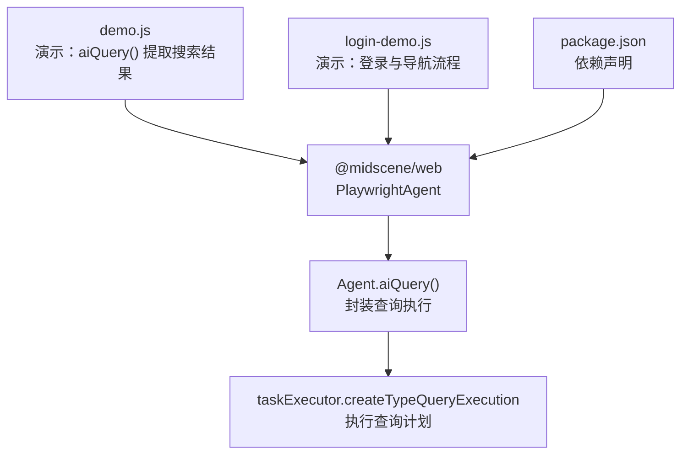
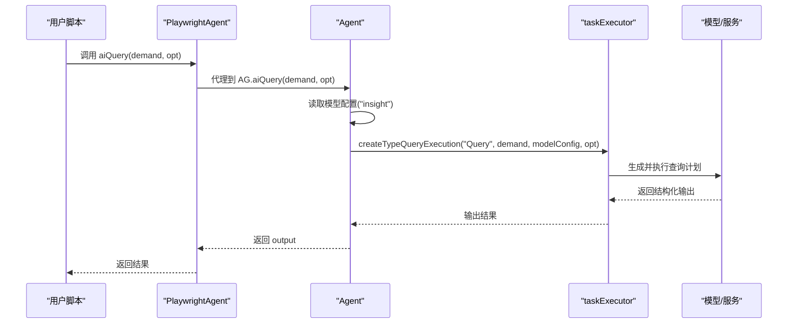
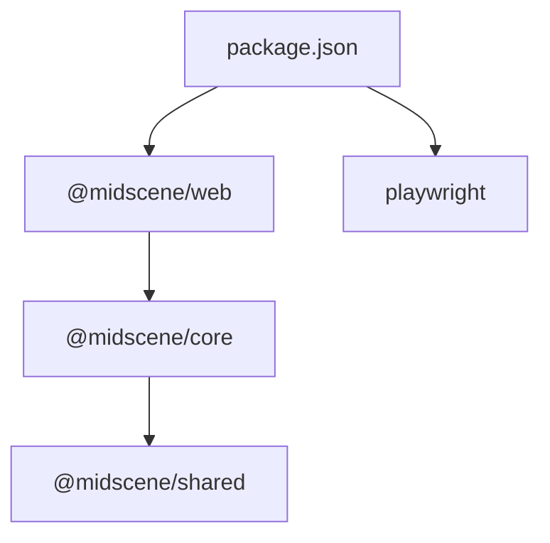

# 数据提取与结构化输出

<cite>
**本文引用的文件**
- [demo.js](file://demo.js)
- [login-demo.js](file://login-demo.js)
- [package.json](file://package.json)
- [agent.js](file://node_modules/@midscene/core/dist/lib/agent/agent.js)
- [example-code.js](file://node_modules/@midscene/shared/dist/lib/constants/example-code.js)
</cite>

## 目录
1. [简介](#简介)
2. [项目结构](#项目结构)
3. [核心组件](#核心组件)
4. [架构总览](#架构总览)
5. [详细组件分析](#详细组件分析)
6. [依赖关系分析](#依赖关系分析)
7. [性能考量](#性能考量)
8. [故障排查指南](#故障排查指南)
9. [结论](#结论)
10. [附录](#附录)

## 简介
本文件围绕页面数据提取与结构化输出机制展开，重点解析 aiQuery() 方法的工作原理与实现细节，涵盖以下主题：
- aiQuery() 的调用链路与参数规范
- 结构化数据模式定义与返回格式
- 复杂查询需求的处理策略
- 查询语法规范与示例
- 数据提取的准确性保障、错误处理与超时控制
- 与 AI 模型的协作方式及动态提取策略
- 实际提取案例（文本、属性、列表）

## 项目结构
本仓库包含两个演示脚本与依赖声明，核心逻辑位于 @midscene/web 提供的 PlaywrightAgent 封装中，aiQuery() 方法由底层 Agent 类实现。

图表来源
- [demo.js:28-31](file://demo.js#L28-L31)
- [login-demo.js:16-18](file://login-demo.js#L16-L18)
- [package.json:12-16](file://package.json#L12-L16)
- [agent.js:432-437](file://node_modules/@midscene/core/dist/lib/agent/agent.js#L432-L437)

章节来源
- [demo.js:1-44](file://demo.js#L1-L44)
- [login-demo.js:1-53](file://login-demo.js#L1-L53)
- [package.json:1-18](file://package.json#L1-L18)

## 核心组件
- PlaywrightAgent：面向用户的高层 API，负责与浏览器交互与数据提取。
- Agent.aiQuery()：统一入口，封装类型化查询执行。
- taskExecutor.createTypeQueryExecution：执行器，按查询类型（如 Query、Boolean、Number、String、Assert）调度模型与上下文。
- defaultServiceExtractOption：默认服务提取选项，控制是否包含 DOM 与截图等辅助信息。

章节来源
- [agent.js:75-83](file://node_modules/@midscene/core/dist/lib/agent/agent.js#L75-L83)
- [agent.js:432-437](file://node_modules/@midscene/core/dist/lib/agent/agent.js#L432-L437)

## 架构总览
aiQuery() 的调用链路如下：

图表来源
- [agent.js:432-437](file://node_modules/@midscene/core/dist/lib/agent/agent.js#L432-L437)

## 详细组件分析

### aiQuery() 方法工作原理
- 入口参数
  - demand：查询需求，可为字符串或对象。字符串形式用于自然语言描述；对象形式用于结构化模式定义。
  - opt：可选配置，默认使用 defaultServiceExtractOption。
- 内部流程
  - 读取模型配置（insight）以确定推理与提取策略。
  - 通过 taskExecutor.createTypeQueryExecution 创建“Query”类型的执行计划。
  - 返回执行器输出的结构化结果。
- 默认选项
  - domIncluded: false
  - screenshotIncluded: true

章节来源
- [agent.js:432-437](file://node_modules/@midscene/core/dist/lib/agent/agent.js#L432-L437)
- [agent.js:75-83](file://node_modules/@midscene/core/dist/lib/agent/agent.js#L75-L83)

### 查询语法规范与示例
- 字符串形式
  - 语法：形如 "{模式定义}, 描述性查询语句"。例如演示脚本中的“{titles: string[]}, 获取搜索结果前3个标题”。
  - 作用：同时表达期望的结构化模式与具体提取目标。
- 对象形式
  - 语法：键值对，键为输出字段名，值为对该字段的格式约束说明（自然语言）。
  - 示例：参考共享常量中的示例，定义多个字段及其格式要求。
- 返回类型与格式
  - 返回值为 JSON 对象，字段名与模式定义一致。
  - 支持数组、数字、布尔、字符串等基础类型，以及复合对象结构。

章节来源
- [demo.js:28-31](file://demo.js#L28-L31)
- [example-code.js:96-101](file://node_modules/@midscene/shared/dist/lib/constants/example-code.js#L96-L101)

### 数据提取准确性保障机制
- 上下文获取与重试
  - Agent 在执行动作或提取前会获取 UI 上下文，并支持可重试的上下文错误处理，避免因页面状态不稳定导致的提取失败。
- 定位验证
  - aiDescribe/aiLocate 流程包含定位验证步骤，计算期望中心与实际元素中心距离或包含关系，确保定位准确。
- 截图与 DOM 信息
  - 默认启用截图包含，必要时可开启 DOM 包含，辅助模型更准确地识别目标区域与结构。

章节来源
- [agent.js:144-157](file://node_modules/@midscene/core/dist/lib/agent/agent.js#L144-L157)
- [agent.js:459-500](file://node_modules/@midscene/core/dist/lib/agent/agent.js#L459-L500)

### 错误处理策略
- aiAssert 断言
  - 当断言失败时，抛出带原因的错误；若 keepRawResponse 开启，则返回包含 pass、thought、message 的对象以便上层处理。
- TaskExecutionError
  - 若执行过程中出现任务级错误，会提取 thought 与原始错误信息，构造可读的失败原因。
- 通用异常
  - 其他未预期错误会被捕获并重新抛出，保留原始错误作为 cause，便于调试。

章节来源
- [agent.js:518-555](file://node_modules/@midscene/core/dist/lib/agent/agent.js#L518-L555)

### 超时控制
- aiWaitFor
  - 提供等待条件满足的能力，默认超时 15 秒，轮询间隔 3 秒；可通过 opt 覆盖。
- 页面等待
  - 演示脚本中使用 waitForTimeout 控制页面稳定时间，确保 DOM 加载完成后再进行提取。

章节来源
- [agent.js:556-563](file://node_modules/@midscene/core/dist/lib/agent/agent.js#L556-L563)
- [demo.js:40-41](file://demo.js#L40-L41)

### 与 AI 模型的协作方式
- 模型配置选择
  - aiQuery 使用“insight”模型配置，确保提取与推理能力匹配。
- 动态提取策略
  - 根据查询类型（Query/Boolean/Number/String/Assert）与需求描述，动态构建执行计划，结合截图与 DOM 上下文，引导模型聚焦目标区域与字段。
- 规划与执行分离
  - 先规划（planning），再执行（default），通过任务执行器统一调度，提升稳定性与可扩展性。

章节来源
- [agent.js:432-437](file://node_modules/@midscene/core/dist/lib/agent/agent.js#L432-L437)
- [agent.js:508-511](file://node_modules/@midscene/core/dist/lib/agent/agent.js#L508-L511)

### 实际数据提取案例

#### 案例一：文本提取（字符串数组）
- 需求：从搜索结果页提取前 N 个标题。
- 语法："{titles: string[]}, 获取搜索结果前3个标题"
- 步骤：
  - 打开目标页面并触发搜索。
  - 调用 aiQuery，传入上述字符串形式的需求。
  - 返回 JSON 对象，包含 titles 字段（字符串数组）。

章节来源
- [demo.js:28-31](file://demo.js#L28-L31)

#### 案例二：复合对象提取
- 需求：提取用户信息与首个商品信息，包含名称与价格。
- 语法：对象形式，键为字段名，值为格式约束说明。
- 步骤：
  - 准备页面（如登录后进入详情页）。
  - 调用 aiQuery，传入对象形式的需求。
  - 返回 JSON 对象，包含 userInfo 与 theFirstProductInfo 等字段。

章节来源
- [example-code.js:96-101](file://node_modules/@midscene/shared/dist/lib/constants/example-code.js#L96-L101)

#### 案例三：列表数据处理
- 需求：提取多个条目（如订单列表、产品列表）。
- 语法：在模式定义中使用数组类型（如 string[]、object[]），并在描述中明确数量或筛选条件。
- 步骤：
  - 确保页面加载完成（可配合 aiWaitFor 或 waitForTimeout）。
  - 调用 aiQuery，传入数组模式与描述。
  - 返回结构化数组，逐项包含所需字段。

章节来源
- [demo.js:28-31](file://demo.js#L28-L31)
- [agent.js:556-563](file://node_modules/@midscene/core/dist/lib/agent/agent.js#L556-L563)

## 依赖关系分析
- 依赖 @midscene/web：提供 PlaywrightAgent 封装与高层 API。
- 依赖 playwright：提供浏览器驱动与页面操作能力。
- 依赖 @midscene/core 与 @midscene/shared：提供 Agent 实现、示例代码与工具函数。

图表来源
- [package.json:12-16](file://package.json#L12-L16)

章节来源
- [package.json:1-18](file://package.json#L1-18)

## 性能考量
- 截图与 DOM 包含
  - 默认启用截图包含，有助于模型理解布局；DOM 包含可能增加传输与处理开销，建议仅在必要时开启。
- 上下文获取重试
  - 在网络波动或页面渲染不稳定时，重试机制可提升成功率，但会增加整体耗时。
- 轮询等待
  - aiWaitFor 的轮询间隔与超时需权衡响应速度与稳定性；过短可能导致频繁轮询，过长影响吞吐。

## 故障排查指南
- 断言失败
  - 使用 aiAssert 并检查返回的 thought 与 message，定位失败原因。
- 任务执行错误
  - 捕获 TaskExecutionError，查看错误任务的 thought 与原始错误，结合截图与 DOM 信息复盘。
- 页面未就绪
  - 在 aiQuery 前使用 aiWaitFor 或 waitForTimeout，确保 DOM 与资源加载完成。
- 模型非视觉能力
  - 确保使用的模型具备视觉理解能力，否则可能无法正确解析页面结构。

章节来源
- [agent.js:518-555](file://node_modules/@midscene/core/dist/lib/agent/agent.js#L518-L555)
- [agent.js:556-563](file://node_modules/@midscene/core/dist/lib/agent/agent.js#L556-L563)

## 结论
aiQuery() 通过统一的类型化查询接口，将自然语言需求与结构化模式定义相结合，借助任务执行器与模型配置，实现稳定、可扩展的数据提取。默认选项与上下文重试机制提升了鲁棒性，而断言与超时控制则保障了流程可控。开发者可根据业务场景灵活选择字符串或对象形式的查询语法，并结合截图与 DOM 信息优化提取效果。

## 附录
- 查询语法要点
  - 字符串："{模式定义}, 描述性语句"
  - 对象：键为字段名，值为格式约束说明
- 返回格式
  - JSON 对象，字段与模式一致，支持基础类型与复合结构
- 最佳实践
  - 明确数量限制与字段约束
  - 页面稳定后再提取
  - 必要时开启 DOM 包含以增强模型理解