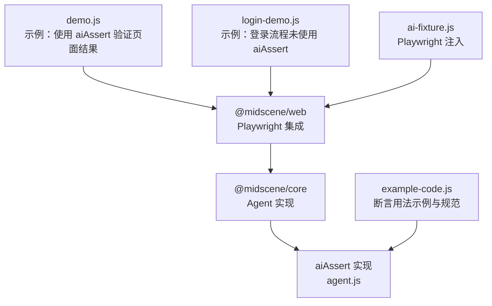
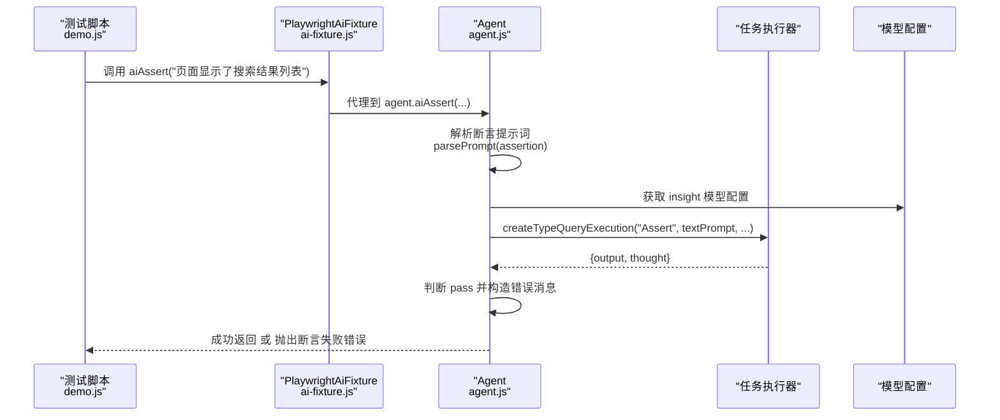
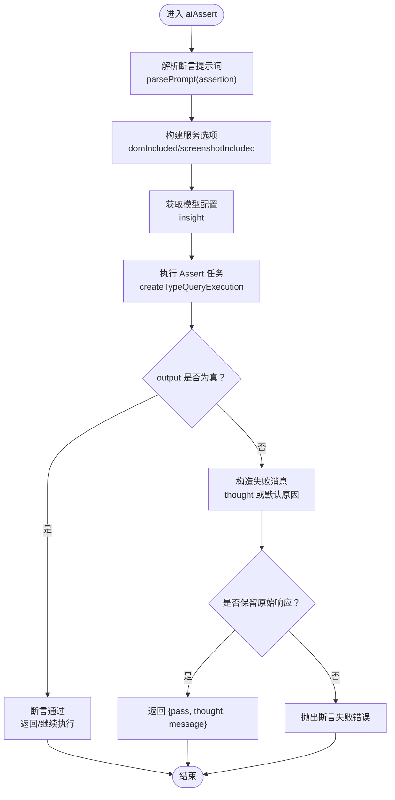
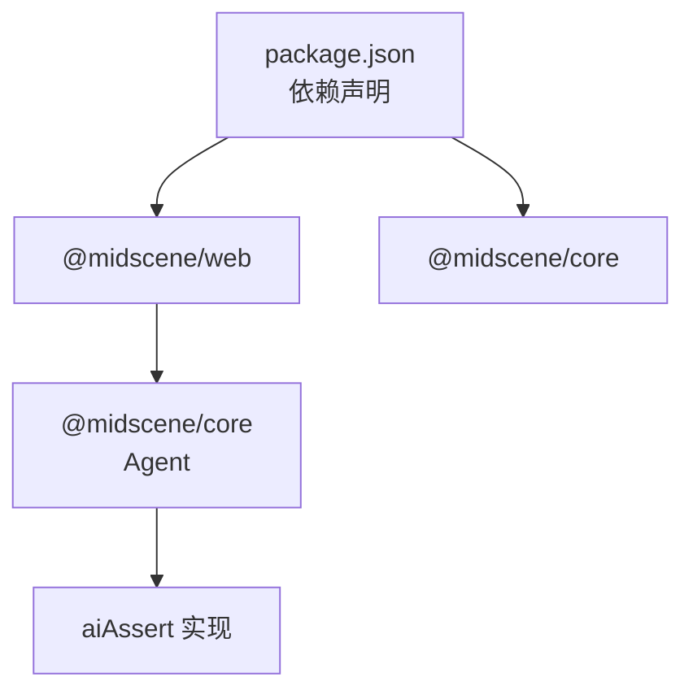

# 断言验证机制

<cite>
**本文引用的文件**
- [demo.js](file://demo.js)
- [login-demo.js](file://login-demo.js)
- [agent.js](file://node_modules/@midscene/core/dist/lib/agent/agent.js)
- [example-code.js](file://node_modules/@midscene/shared/dist/lib/constants/example-code.js)
- [ai-fixture.js](file://node_modules/@midscene/web/dist/lib/playwright/ai-fixture.js)
- [package.json](file://package.json)
</cite>

## 目录
1. [引言](#引言)
2. [项目结构](#项目结构)
3. [核心组件](#核心组件)
4. [架构总览](#架构总览)
5. [详细组件分析](#详细组件分析)
6. [依赖关系分析](#依赖关系分析)
7. [性能考量](#性能考量)
8. [故障排查指南](#故障排查指南)
9. [结论](#结论)
10. [附录](#附录)

## 引言
本技术文档围绕断言验证机制展开，重点解释 aiAssert() 方法的设计理念与实现原理，涵盖页面状态验证、元素存在性检查、操作结果确认等关键能力。文档还系统阐述断言规则编写规范、验证策略选择、失败处理机制，并给出不同断言场景（页面加载、元素状态、数据完整性）的最佳实践与常见陷阱，以及断言失败时的调试方法与错误信息分析。

## 项目结构
本仓库包含两个示例脚本与若干依赖模块，其中与断言验证直接相关的核心实现位于 @midscene/core 的 Agent 类中，Playwright 集成通过 @midscene/web 提供的 ai-fixture 将 aiAssert 等方法注入到测试环境中；示例脚本演示了如何在真实页面上使用 aiAssert 进行断言。

图表来源
- [demo.js:33-35](file://demo.js#L33-L35)
- [agent.js:517-555](file://node_modules/@midscene/core/dist/lib/agent/agent.js#L517-L555)
- [ai-fixture.js:279-285](file://node_modules/@midscene/web/dist/lib/playwright/ai-fixture.js#L279-L285)
- [example-code.js:86-109](file://node_modules/@midscene/shared/dist/lib/constants/example-code.js#L86-L109)

章节来源
- [demo.js:1-44](file://demo.js#L1-L44)
- [login-demo.js:1-52](file://login-demo.js#L1-L52)
- [package.json:12-16](file://package.json#L12-L16)

## 核心组件
- Agent.aiAssert：断言主入口，负责将自然语言断言转换为可执行的验证逻辑，返回布尔结果或抛出异常。
- PlaywrightAiFixture.aiAssert：在 Playwright 测试环境中注入 aiAssert 能力，便于在测试用例中直接调用。
- 示例与规范：提供断言规则编写范式与错误消息定制方式，帮助团队统一断言风格。

章节来源
- [agent.js:517-555](file://node_modules/@midscene/core/dist/lib/agent/agent.js#L517-L555)
- [ai-fixture.js:279-285](file://node_modules/@midscene/web/dist/lib/playwright/ai-fixture.js#L279-L285)
- [example-code.js:51](file://node_modules/@midscene/shared/dist/lib/constants/example-code.js#L51)

## 架构总览
下图展示了从测试脚本到断言执行的关键路径：测试脚本通过 PlaywrightAgent 调用 aiAssert，内部委托给任务执行器与模型配置，最终生成断言结果并按需抛出异常。

图表来源
- [demo.js:33-35](file://demo.js#L33-L35)
- [agent.js:517-555](file://node_modules/@midscene/core/dist/lib/agent/agent.js#L517-L555)
- [ai-fixture.js:279-285](file://node_modules/@midscene/web/dist/lib/playwright/ai-fixture.js#L279-L285)

## 详细组件分析

### aiAssert 设计与实现
- 输入与解析
  - 接收自然语言断言字符串或对象，内部通过提示词解析函数拆分为文本提示与多模态提示。
  - 支持通过选项参数控制是否包含 DOM 截图、是否保留原始响应等。
- 执行与判断
  - 基于“Assert”类型的任务执行，调用模型生成输出与思考过程。
  - 输出为真值则断言通过，否则根据传入的错误消息或断言文本生成失败原因。
- 错误处理
  - 若为任务执行错误，提取任务中的 thought 与原始错误信息，拼接为可读的失败原因。
  - 可通过 keepRawResponse 返回原始响应而不抛错，便于上层自定义处理。
- 典型调用
  - 在示例脚本中，对“页面显示了搜索结果列表”进行断言，若失败会抛出错误并终止后续步骤。

图表来源
- [agent.js:517-555](file://node_modules/@midscene/core/dist/lib/agent/agent.js#L517-L555)

章节来源
- [agent.js:517-555](file://node_modules/@midscene/core/dist/lib/agent/agent.js#L517-L555)
- [demo.js:33-35](file://demo.js#L33-L35)

### Playwright 集成与注入
- ai-fixture 将 aiAssert 注入到测试环境，使测试用例可以直接使用 aiAssert 对页面状态进行断言。
- 注入后，测试脚本无需手动管理 Agent 生命周期，即可在 beforeEach/it 中直接调用 aiAssert。

章节来源
- [ai-fixture.js:279-285](file://node_modules/@midscene/web/dist/lib/playwright/ai-fixture.js#L279-L285)

### 断言规则编写规范与最佳实践
- 规范
  - 使用自然语言清晰描述期望状态，避免模糊表达。
  - 在 YAML/Playwright 场景中，可通过 errorMessage 字段定制失败消息，提升可读性。
- 最佳实践
  - 将断言置于关键操作之后，确保页面状态稳定后再验证。
  - 对于复杂状态，优先组合多个具体断言，降低误判概率。
  - 使用 keepRawResponse 收集失败原因，便于日志与报告分析。
- 常见陷阱
  - 过早断言：页面尚未渲染完成即断言，导致误报。
  - 过于宽泛的断言：无法有效定位问题，建议细化到具体元素或内容。
  - 忽略失败原因：不查看 thought 与原始错误，难以快速定位根因。

章节来源
- [example-code.js:51](file://node_modules/@midscene/shared/dist/lib/constants/example-code.js#L51)
- [example-code.js:242-243](file://node_modules/@midscene/shared/dist/lib/constants/example-code.js#L242-L243)

### 验证策略与应用场景
- 页面加载验证
  - 通过断言页面主体内容或关键元素是否存在，确认页面已加载完成。
- 元素状态验证
  - 验证按钮可用性、输入框内容、列表项数量等，确保交互结果符合预期。
- 数据完整性验证
  - 结合 aiQuery 提取数据后，使用 aiAssert 校验字段存在性与格式正确性。

章节来源
- [demo.js:28-31](file://demo.js#L28-L31)
- [example-code.js:86-109](file://node_modules/@midscene/shared/dist/lib/constants/example-code.js#L86-L109)

## 依赖关系分析
- 依赖链
  - 测试脚本依赖 @midscene/web 提供的 PlaywrightAgent。
  - PlaywrightAgent 内部封装 Agent，Agent 负责断言与任务执行。
  - 断言执行依赖模型配置与任务执行器，最终产出断言结果。
- 外部依赖
  - Playwright 用于页面控制与截图。
  - OpenAI SDK 用于模型推理（由 @midscene/core 内部集成）。

图表来源
- [package.json:12-16](file://package.json#L12-L16)
- [agent.js:517-555](file://node_modules/@midscene/core/dist/lib/agent/agent.js#L517-L555)

章节来源
- [package.json:12-16](file://package.json#L12-L16)

## 性能考量
- 断言频率与时机
  - 合理安排断言点，避免在高频滚动/输入后立即断言，建议增加短暂等待或使用 aiWaitFor 等待稳定。
- 截图与 DOM 包含
  - 默认可能包含截图与 DOM，频繁断言会增加开销。可根据需要调整 domIncluded/screenshotIncluded 以平衡可观测性与性能。
- 任务超时与重试
  - 对不稳定断言可结合 aiWaitFor 设置合理超时与轮询间隔，减少忙等造成的资源消耗。

## 故障排查指南
- 断言失败的常见原因
  - 页面未完全加载：使用 aiWaitFor 等待稳定后再断言。
  - 断言条件过于严格或与页面实际状态不符：细化断言描述，优先断言具体元素或可见文本。
  - 模型理解偏差：在 errorMessage 中明确期望状态，或提供更具体的上下文提示。
- 错误信息分析
  - 若启用 keepRawResponse，可获取 thought 与 message，结合截图与 DOM 快照定位问题。
  - 对任务执行错误，查看 thought 与原始错误，有助于区分网络/模型/页面状态三类问题。
- 调试建议
  - 在断言前后记录截图与页面快照，便于回溯。
  - 将断言失败归档到报告，统计失败模式，持续优化断言描述。

章节来源
- [agent.js:536-554](file://node_modules/@midscene/core/dist/lib/agent/agent.js#L536-L554)

## 结论
aiAssert() 将自然语言断言转化为可执行的验证流程，结合模型推理与任务执行器，实现了对页面状态、元素存在性与操作结果的可靠校验。通过规范化的断言规则、合理的验证策略与完善的失败处理机制，可在自动化测试中显著提升稳定性与可维护性。建议团队在实践中遵循本文的最佳实践，持续优化断言描述与失败分析流程。

## 附录
- 示例脚本中的断言调用位置
  - [demo.js:33-35](file://demo.js#L33-L35)
- 断言 API 与示例
  - [example-code.js:51](file://node_modules/@midscene/shared/dist/lib/constants/example-code.js#L51)
  - [example-code.js:86-109](file://node_modules/@midscene/shared/dist/lib/constants/example-code.js#L86-L109)
  - [example-code.js:242-243](file://node_modules/@midscene/shared/dist/lib/constants/example-code.js#L242-L243)