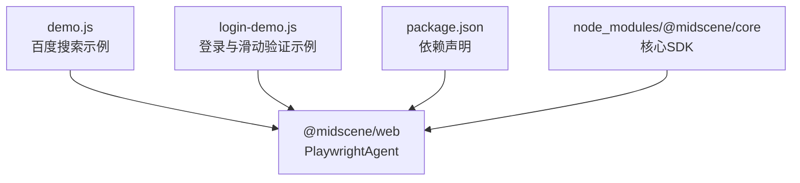
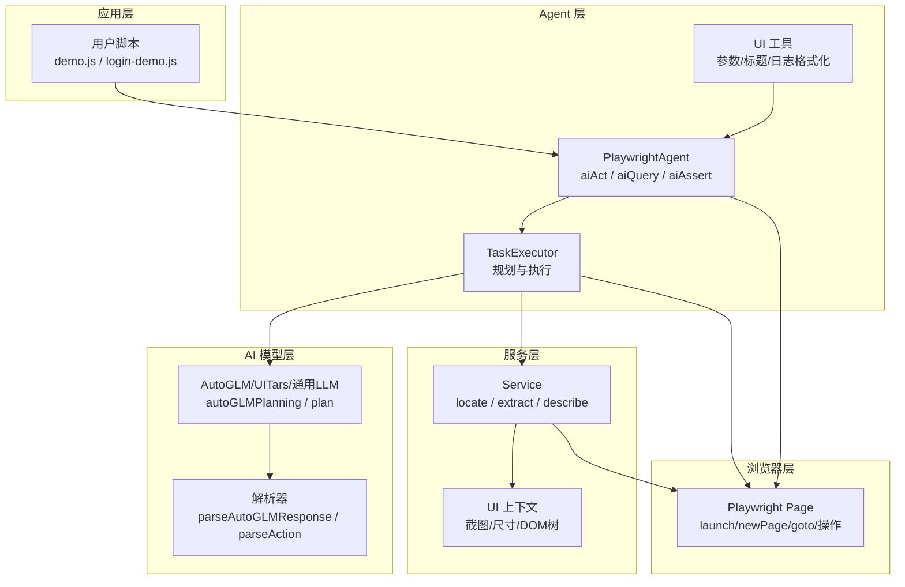
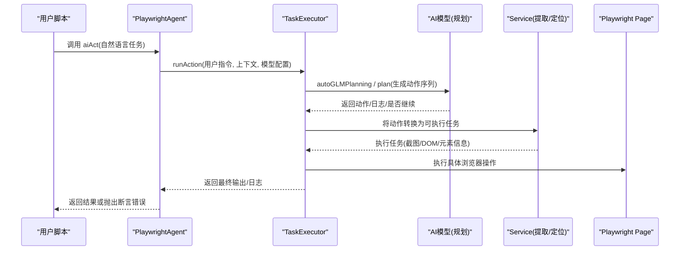
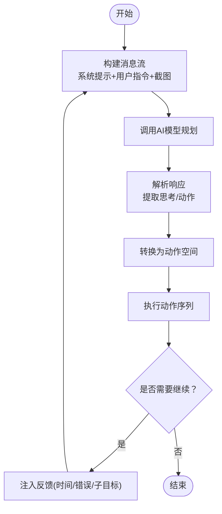
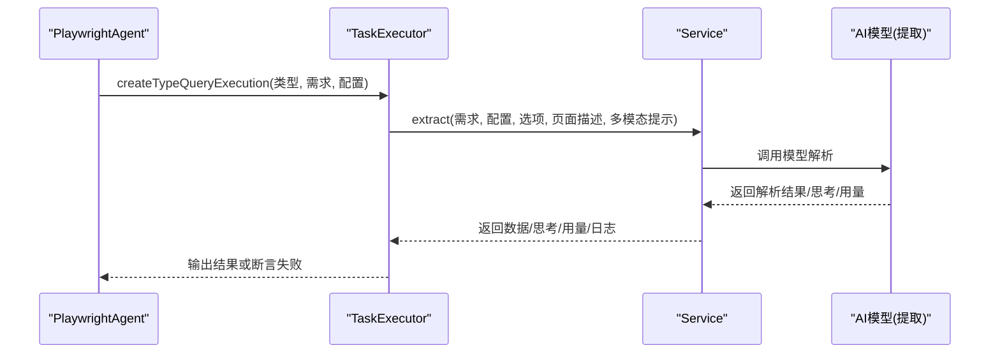
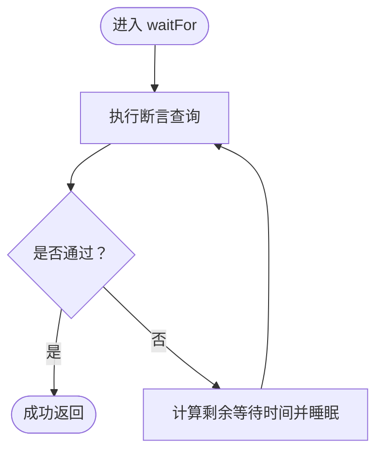
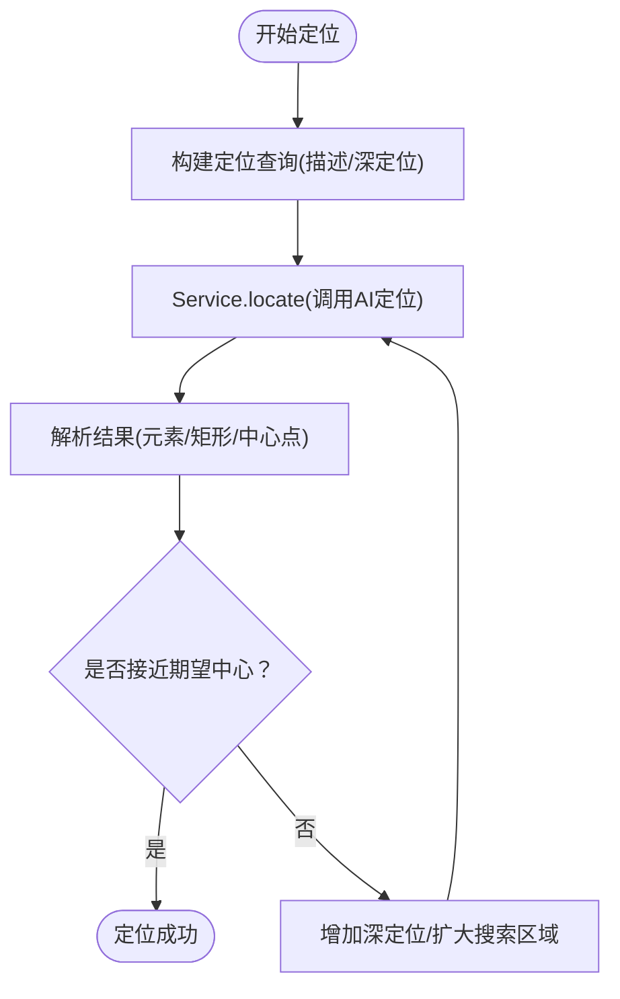
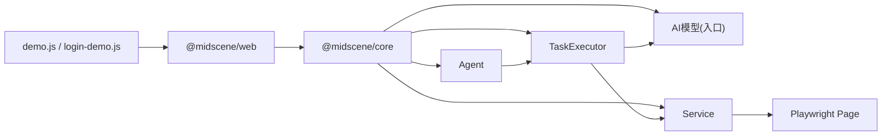

# 核心概念与原理

<cite>
**本文引用的文件**
- [package.json](file://package.json)
- [demo.js](file://demo.js)
- [login-demo.js](file://login-demo.js)
- [agent.js](file://node_modules/@midscene/core/dist/lib/agent/agent.js)
- [tasks.js](file://node_modules/@midscene/core/dist/lib/agent/tasks.js)
- [index.js（AI模型入口）](file://node_modules/@midscene/core/dist/lib/ai-model/index.js)
- [auto-glm/index.js](file://node_modules/@midscene/core/dist/lib/ai-model/auto-glm/index.js)
- [auto-glm/planning.js](file://node_modules/@midscene/core/dist/lib/ai-model/auto-glm/planning.js)
- [auto-glm/parser.js](file://node_modules/@midscene/core/dist/lib/ai-model/auto-glm/parser.js)
- [service/index.js](file://node_modules/@midscene/core/dist/lib/service/index.js)
- [ui-utils.js](file://node_modules/@midscene/core/dist/lib/agent/ui-utils.js)
</cite>

## 目录
1. [引言](#引言)
2. [项目结构](#项目结构)
3. [核心组件](#核心组件)
4. [架构总览](#架构总览)
5. [详细组件分析](#详细组件分析)
6. [依赖关系分析](#依赖关系分析)
7. [性能考量](#性能考量)
8. [故障排查指南](#故障排查指南)
9. [结论](#结论)
10. [附录](#附录)

## 引言
本文件面向具有一定编程基础但对AI驱动的浏览器自动化尚不熟悉的读者，系统性讲解基于 Playwright 的 AI 驱动自动化框架“Midscene”的核心理念与实现方式。重点围绕以下目标展开：
- 解释 PlaywrightAgent 如何将自然语言指令转化为可执行的浏览器操作
- 阐述数据提取与断言验证的技术路径
- 说明页面元素定位策略与复杂交互处理方法
- 描述 AI Action Engine、Data Extraction、Assertion Engine 的协作关系
- 提供架构图与数据流说明，帮助开发者快速理解系统运作机制

## 项目结构
本仓库包含两个示例脚本与依赖包，演示了如何使用 Midscene 的 PlaywrightAgent 在真实浏览器中执行 AI 驱动的操作、数据提取与断言。

**图表来源**
- [demo.js:1-45](file://demo.js#L1-L45)
- [login-demo.js:1-53](file://login-demo.js#L1-L53)
- [package.json:1-18](file://package.json#L1-L18)

**章节来源**
- [demo.js:1-45](file://demo.js#L1-L45)
- [login-demo.js:1-53](file://login-demo.js#L1-L53)
- [package.json:1-18](file://package.json#L1-L18)

## 核心组件
- PlaywrightAgent：对外暴露 aiAct、aiQuery、aiAssert 等方法，封装 AI 规划、动作执行、截图与报告生成等能力
- TaskExecutor：负责将 AI 规划转换为可执行的任务序列，并在会话中循环执行与重规划
- AI 模型适配层（AutoGLM/UITars/通用LLM）：根据模型族选择不同的规划与解析策略
- Service：统一的数据提取、元素定位与描述接口，支持多模态输入（图像+文本）
- UI 工具与上下文：负责 UI 截图、上下文拼装、参数格式化与报告输出

**章节来源**
- [agent.js:106-800](file://node_modules/@midscene/core/dist/lib/agent/agent.js#L106-L800)
- [tasks.js:58-466](file://node_modules/@midscene/core/dist/lib/agent/tasks.js#L58-L466)
- [index.js（AI模型入口）:1-129](file://node_modules/@midscene/core/dist/lib/ai-model/index.js#L1-L129)
- [service/index.js:50-308](file://node_modules/@midscene/core/dist/lib/service/index.js#L50-L308)

## 架构总览
下图展示了从用户调用到浏览器执行的关键路径，以及 AI Action Engine、Data Extraction、Assertion Engine 的协作关系。

**图表来源**
- [agent.js:106-800](file://node_modules/@midscene/core/dist/lib/agent/agent.js#L106-L800)
- [tasks.js:58-466](file://node_modules/@midscene/core/dist/lib/agent/tasks.js#L58-L466)
- [auto-glm/planning.js:35-105](file://node_modules/@midscene/core/dist/lib/ai-model/auto-glm/planning.js#L35-L105)
- [auto-glm/parser.js:203-282](file://node_modules/@midscene/core/dist/lib/ai-model/auto-glm/parser.js#L203-L282)
- [service/index.js:50-308](file://node_modules/@midscene/core/dist/lib/service/index.js#L50-L308)

## 详细组件分析

### PlaywrightAgent：AI 动作、查询与断言的统一入口
- aiAct：接收自然语言任务，结合上下文与模型族选择合适的规划策略，循环重规划直至完成或达到上限
- aiQuery：按需求类型（字符串/数字/布尔/数值/通用）调用服务提取，返回结构化结果
- aiAssert：将断言语句转为布尔判断，失败时抛出带原因的错误
- aiLocate/verifyLocator：基于描述定位元素，支持深度定位与坐标校验
- 冻结页面上下文：在复杂流程中可冻结当前 UI 截图与 DOM，提升稳定性

**图表来源**
- [agent.js:381-429](file://node_modules/@midscene/core/dist/lib/agent/agent.js#L381-L429)
- [tasks.js:129-271](file://node_modules/@midscene/core/dist/lib/agent/tasks.js#L129-L271)
- [auto-glm/planning.js:35-105](file://node_modules/@midscene/core/dist/lib/ai-model/auto-glm/planning.js#L35-L105)
- [service/index.js:157-235](file://node_modules/@midscene/core/dist/lib/service/index.js#L157-L235)

**章节来源**
- [agent.js:106-800](file://node_modules/@midscene/core/dist/lib/agent/agent.js#L106-L800)
- [demo.js:20-35](file://demo.js#L20-L35)
- [login-demo.js:20-42](file://login-demo.js#L20-L42)

### AI Action Engine：从自然语言到可执行动作
- 规划阶段：根据模型族选择 AutoGLM 或通用 LLM 规划函数；将 UI 截图与文本指令组合为消息流，调用模型获取“思考+动作”响应
- 解析阶段：解析模型输出，提取动作类型、参数（如坐标、文本、滚动方向），并转换为可执行的动作空间
- 重规划循环：若模型建议继续，则注入反馈（时间、错误、子目标状态）再次规划，直到完成或超过最大循环次数

**图表来源**
- [auto-glm/planning.js:35-105](file://node_modules/@midscene/core/dist/lib/ai-model/auto-glm/planning.js#L35-L105)
- [auto-glm/parser.js:41-202](file://node_modules/@midscene/core/dist/lib/ai-model/auto-glm/parser.js#L41-L202)
- [tasks.js:129-271](file://node_modules/@midscene/core/dist/lib/agent/tasks.js#L129-L271)

**章节来源**
- [auto-glm/planning.js:35-105](file://node_modules/@midscene/core/dist/lib/ai-model/auto-glm/planning.js#L35-L105)
- [auto-glm/parser.js:203-282](file://node_modules/@midscene/core/dist/lib/ai-model/auto-glm/parser.js#L203-L282)
- [tasks.js:129-271](file://node_modules/@midscene/core/dist/lib/agent/tasks.js#L129-L271)

### Data Extraction：结构化信息抽取与断言
- 类型化查询：aiQuery 支持 String/Number/Boolean/Assert/WaitFor 等类型，内部构造需求并调用服务提取
- 多模态输入：支持将图片与文本一起送入模型，增强定位与提取准确性
- DOM 增强：可选地附加页面节点树描述，帮助模型更准确理解上下文
- 断言与等待：aiAssert 将断言转为布尔判断；waitFor 循环检查直到满足条件或超时

**图表来源**
- [tasks.js:272-359](file://node_modules/@midscene/core/dist/lib/agent/tasks.js#L272-L359)
- [service/index.js:157-235](file://node_modules/@midscene/core/dist/lib/service/index.js#L157-L235)

**章节来源**
- [tasks.js:272-359](file://node_modules/@midscene/core/dist/lib/agent/tasks.js#L272-L359)
- [service/index.js:157-235](file://node_modules/@midscene/core/dist/lib/service/index.js#L157-L235)

### Assertion Engine：断言与等待
- aiAssert：将断言语句包装为布尔判断，失败时携带模型给出的原因信息
- waitFor：在超时与检查间隔内循环断言，必要时插入睡眠任务，避免忙等

**图表来源**
- [tasks.js:360-406](file://node_modules/@midscene/core/dist/lib/agent/tasks.js#L360-L406)

**章节来源**
- [tasks.js:360-406](file://node_modules/@midscene/core/dist/lib/agent/tasks.js#L360-L406)

### 元素定位策略与复杂交互
- 定位：aiLocate 基于描述定位元素，支持深定位（在已知区域附近搜索），并可与计划中的定位结果联动
- 校验：verifyLocator 将模型输出的定位结果与期望中心点比较，确保定位精度
- 交互：Agent 提供多种交互方法（点击、双击、长按、输入、滚动、捏合等），均通过动作空间统一调度

**图表来源**
- [agent.js:501-517](file://node_modules/@midscene/core/dist/lib/agent/agent.js#L501-L517)
- [agent.js:486-500](file://node_modules/@midscene/core/dist/lib/agent/agent.js#L486-L500)
- [service/index.js:50-156](file://node_modules/@midscene/core/dist/lib/service/index.js#L50-L156)

**章节来源**
- [agent.js:501-517](file://node_modules/@midscene/core/dist/lib/agent/agent.js#L501-L517)
- [agent.js:486-500](file://node_modules/@midscene/core/dist/lib/agent/agent.js#L486-L500)
- [service/index.js:50-156](file://node_modules/@midscene/core/dist/lib/service/index.js#L50-L156)

## 依赖关系分析
- 依赖关系概览：用户脚本依赖 @midscene/web（导出 PlaywrightAgent），后者内部依赖 @midscene/core 的 Agent、TaskExecutor、AI 模型与 Service
- 关键耦合点：
  - Agent 与 TaskExecutor：Agent 负责高层 API，TaskExecutor 负责规划与执行循环
  - TaskExecutor 与 AI 模型：根据模型族选择不同规划实现（AutoGLM/UITars/通用）
  - TaskExecutor 与 Service：统一的数据与定位入口
  - Service 与 Playwright：通过截图与 DOM 信息驱动模型决策

**图表来源**
- [package.json:12-16](file://package.json#L12-L16)
- [agent.js:719-800](file://node_modules/@midscene/core/dist/lib/agent/agent.js#L719-L800)
- [tasks.js:407-435](file://node_modules/@midscene/core/dist/lib/agent/tasks.js#L407-L435)
- [index.js（AI模型入口）:1-129](file://node_modules/@midscene/core/dist/lib/ai-model/index.js#L1-L129)
- [service/index.js:50-308](file://node_modules/@midscene/core/dist/lib/service/index.js#L50-L308)

**章节来源**
- [package.json:12-16](file://package.json#L12-L16)
- [agent.js:719-800](file://node_modules/@midscene/core/dist/lib/agent/agent.js#L719-L800)
- [tasks.js:407-435](file://node_modules/@midscene/core/dist/lib/agent/tasks.js#L407-L435)
- [index.js（AI模型入口）:1-129](file://node_modules/@midscene/core/dist/lib/ai-model/index.js#L1-L129)
- [service/index.js:50-308](file://node_modules/@midscene/core/dist/lib/service/index.js#L50-L308)

## 性能考量
- 重规划上限：默认最大重规划轮次可配置，避免复杂任务导致无限循环
- 截图与上下文：合理控制截图尺寸与包含 DOM 的范围，平衡精度与性能
- 缓存：支持将 YAML 流式规划缓存，加速重复任务
- 等待策略：waitFor 使用固定间隔与超时，避免忙等；必要时可调整间隔与超时参数
- 模型选择：不同模型族在定位与解析上的表现不同，应根据场景选择合适模型

[本节为通用指导，无需列出具体文件来源]

## 故障排查指南
- 断言失败：aiAssert 会在失败时抛出包含原因的错误，便于定位问题
- 重规划超限：当超过最大重规划轮次，系统会终止并提示增大限制
- 解析错误：AI 响应解析异常会记录原始响应与用量，便于回溯
- 文件上传：使用文件选择器时需确保环境支持，否则会报不支持错误
- 上下文冻结：在复杂流程中可冻结 UI 上下文，减少动态变化带来的误差

**章节来源**
- [tasks.js:334-359](file://node_modules/@midscene/core/dist/lib/agent/tasks.js#L334-L359)
- [tasks.js:255-258](file://node_modules/@midscene/core/dist/lib/agent/tasks.js#L255-L258)
- [tasks.js:184-192](file://node_modules/@midscene/core/dist/lib/agent/tasks.js#L184-L192)
- [tasks.js:436-451](file://node_modules/@midscene/core/dist/lib/agent/tasks.js#L436-L451)
- [agent.js:665-676](file://node_modules/@midscene/core/dist/lib/agent/agent.js#L665-L676)

## 结论
Midscene 的 PlaywrightAgent 将自然语言指令转化为可执行的浏览器操作，通过 AI Action Engine、Data Extraction 与 Assertion Engine 的协同工作，实现了从“意图”到“结果”的闭环。其核心优势在于：
- 统一的 Agent API 与灵活的模型适配
- 基于截图与 DOM 的多模态上下文
- 可重规划的执行循环与完善的错误反馈
- 易用的断言与等待机制

对于初学者，建议先从简单的 aiAct 示例入手，逐步掌握 aiQuery 与 aiAssert 的使用，再探索复杂交互与定位策略。

[本节为总结性内容，无需列出具体文件来源]

## 附录
- 示例脚本说明
  - 百度搜索示例：展示 aiAct、aiQuery、aiAssert 的基本用法
  - 登录与滑动验证示例：演示复杂交互（输入、拖拽、导航）与断言等待

**章节来源**
- [demo.js:20-35](file://demo.js#L20-L35)
- [login-demo.js:20-42](file://login-demo.js#L20-L42)