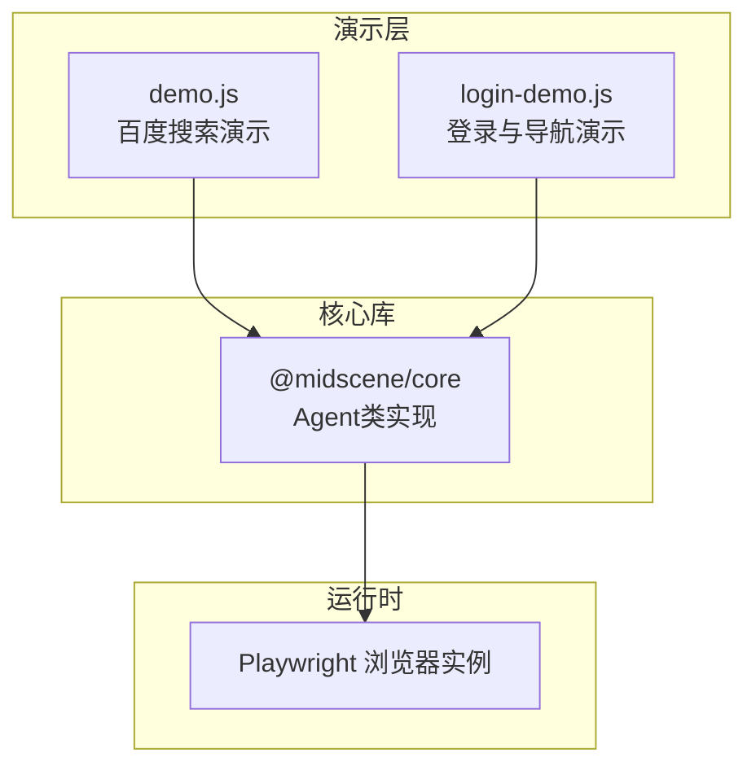
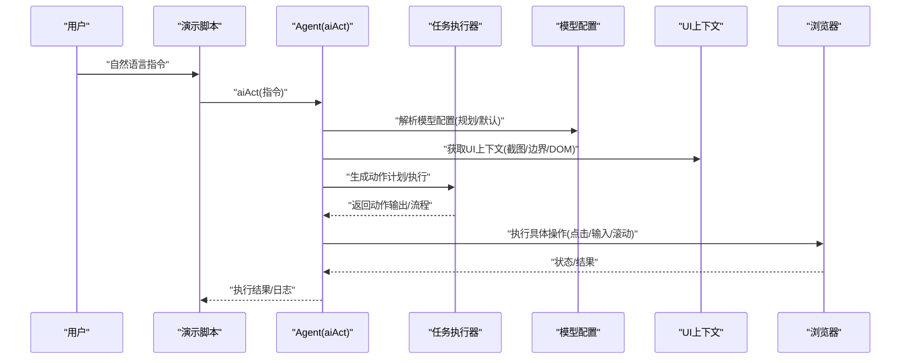
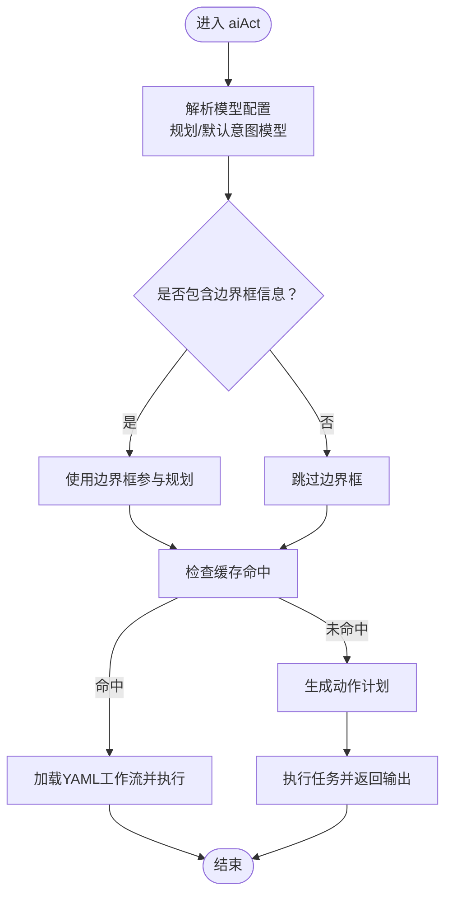
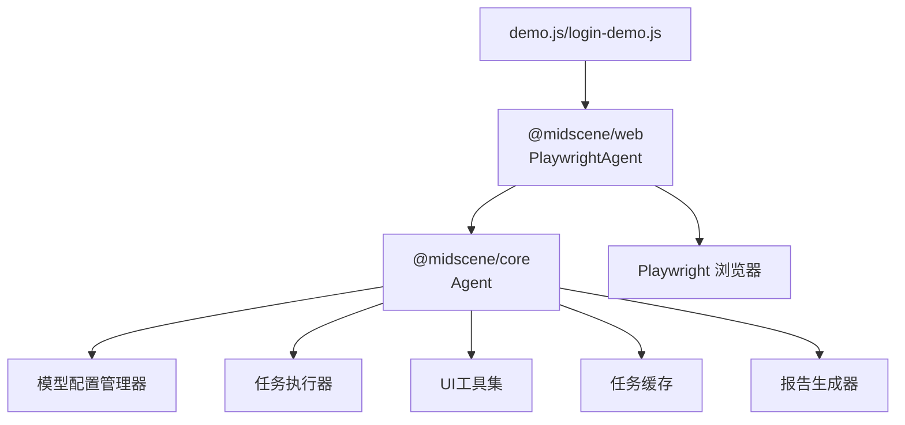

# 自然语言处理机制

<cite>
**本文档引用的文件**
- [demo.js](file://demo.js)
- [login-demo.js](file://login-demo.js)
- [agent.js](file://node_modules/@midscene/core/dist/lib/agent/agent.js)
- [package.json](file://package.json)
</cite>

## 目录
1. [简介](#简介)
2. [项目结构](#项目结构)
3. [核心组件](#核心组件)
4. [架构总览](#架构总览)
5. [详细组件分析](#详细组件分析)
6. [依赖关系分析](#依赖关系分析)
7. [性能考量](#性能考量)
8. [故障排查指南](#故障排查指南)
9. [结论](#结论)
10. [附录](#附录)

## 简介
本文件面向需要掌握AI指令编写的开发者，系统性阐述该代码库中的自然语言处理机制与AI自动化工作流。重点解释如下内容：
- AI如何理解并解析用户的自然语言指令（aiAct方法）
- 指令格式规范、语义分析过程与操作意图识别
- 将人类可读指令转换为精确的浏览器操作序列的流程
- 不同类型指令模式（导航、交互、数据提取）的差异与处理方式
- 上下文感知机制与指令执行的容错处理
- 复杂操作组合指令的最佳实践与示例

## 项目结构
该项目包含两个演示脚本与对底层Agent能力的调用。整体结构清晰，采用“演示脚本 + 核心Agent”分层设计。

图表来源
- [demo.js:1-44](file://demo.js#L1-L44)
- [login-demo.js:1-52](file://login-demo.js#L1-L52)
- [agent.js:106-170](file://node_modules/@midscene/core/dist/lib/agent/agent.js#L106-L170)

章节来源
- [demo.js:1-44](file://demo.js#L1-L44)
- [login-demo.js:1-52](file://login-demo.js#L1-L52)
- [package.json:12-16](file://package.json#L12-L16)

## 核心组件
- PlaywrightAgent：封装浏览器操作接口，对外暴露aiAct、aiQuery、aiAssert等方法，负责将自然语言指令转化为具体动作序列。
- Agent（@midscene/core）：内部实现aiAct、aiQuery、aiAssert等方法，管理上下文、缓存、重规划循环、模型配置与任务执行器。
- 任务执行器与模型配置：根据指令类型选择合适的模型家族（如UI-TARS、AutoGLM），并决定是否启用深度定位、缓存策略与重规划次数限制。
- 上下文感知：通过快照页面UI上下文（截图、元素边界框、DOM信息）辅助定位与验证，支持冻结/解冻上下文以提升稳定性。

章节来源
- [demo.js:16-18](file://demo.js#L16-L18)
- [login-demo.js:16-18](file://login-demo.js#L16-L18)
- [agent.js:114-116](file://node_modules/@midscene/core/dist/lib/agent/agent.js#L114-L116)
- [agent.js:136-157](file://node_modules/@midscene/core/dist/lib/agent/agent.js#L136-L157)
- [agent.js:380-429](file://node_modules/@midscene/core/dist/lib/agent/agent.js#L380-L429)

## 架构总览
下图展示了从用户输入自然语言到浏览器执行动作的端到端流程，以及与Agent内部模块的关系。

图表来源
- [demo.js:24-35](file://demo.js#L24-L35)
- [agent.js:380-429](file://node_modules/@midscene/core/dist/lib/agent/agent.js#L380-L429)
- [agent.js:136-157](file://node_modules/@midscene/core/dist/lib/agent/agent.js#L136-L157)

## 详细组件分析

### aiAct()方法工作原理
aiAct是自然语言到浏览器操作的核心入口。其关键步骤包括：
- 解析模型配置：区分“规划模型”和“默认意图模型”，并根据模型族选择是否包含边界框信息、是否启用深度定位。
- 缓存策略：基于指令与模型族判断是否命中缓存；若命中则直接加载YAML工作流并执行，否则生成新计划并写入缓存。
- 重规划循环：根据模型族与配置限制最大重规划轮次，避免无限循环。
- 执行与回退：调用任务执行器生成动作输出，必要时进行文件选择器归一化、深度定位与异常中断处理。

图表来源
- [agent.js:380-429](file://node_modules/@midscene/core/dist/lib/agent/agent.js#L380-L429)

章节来源
- [agent.js:380-429](file://node_modules/@midscene/core/dist/lib/agent/agent.js#L380-L429)

### 指令格式规范与语义分析
- 指令应明确目标与步骤，例如“在搜索框中输入关键词，然后点击搜索按钮”。演示脚本中提供了典型范式。
- Agent内部会将自然语言指令与当前UI上下文结合，通过模型进行意图识别与定位，再生成可执行的动作序列。
- 对于复杂场景（如滑动验证、菜单搜索），建议拆分为多个子指令或在单条指令中使用“然后”串联步骤，确保顺序与原子性。

章节来源
- [demo.js:24-25](file://demo.js#L24-L25)
- [login-demo.js:24-31](file://login-demo.js#L24-L31)
- [login-demo.js:36-37](file://login-demo.js#L36-L37)

### 操作意图识别与动作空间
- Agent提供多种高阶动作封装：点击、右键、双击、悬停、输入、键盘按键等，并统一映射到动作空间。
- 对于输入类操作，支持值与定位参数分离，允许追加模式（如追加输入）。
- 定位参数通过“构建详细定位参数”的方式生成，结合UI上下文进行元素定位与验证。

章节来源
- [agent.js:247-304](file://node_modules/@midscene/core/dist/lib/agent/agent.js#L247-L304)
- [agent.js:501-516](file://node_modules/@midscene/core/dist/lib/agent/agent.js#L501-L516)

### 数据提取与断言
- aiQuery：用于从页面提取结构化数据，支持指定返回类型（字符串数组、布尔、数字、字符串等）。
- aiAssert：对页面状态进行断言，失败时抛出错误并附带原因；支持保留原始响应以便调试。
- aiWaitFor：等待满足条件，内置超时与轮询间隔配置。

章节来源
- [demo.js:28-30](file://demo.js#L28-L30)
- [demo.js:33-35](file://demo.js#L33-L35)
- [agent.js:433-455](file://node_modules/@midscene/core/dist/lib/agent/agent.js#L433-L455)
- [agent.js:518-555](file://node_modules/@midscene/core/dist/lib/agent/agent.js#L518-L555)
- [agent.js:556-562](file://node_modules/@midscene/core/dist/lib/agent/agent.js#L556-L562)

### 上下文感知与容错处理
- 上下文获取：在每次动作前获取UI上下文（截图、元素边界、DOM信息），并支持重试与非可重试错误处理。
- 冻结上下文：可冻结当前页面上下文，便于在多步操作间保持一致性。
- 定位验证：通过距离阈值与包含关系校验定位准确性，失败时自动重试或启用深度定位。
- 缓存与回放：对可缓存的计划进行缓存，命中后直接回放，减少重复计算与不确定性。

章节来源
- [agent.js:136-157](file://node_modules/@midscene/core/dist/lib/agent/agent.js#L136-L157)
- [agent.js:165-169](file://node_modules/@midscene/core/dist/lib/agent/agent.js#L165-L169)
- [agent.js:486-500](file://node_modules/@midscene/core/dist/lib/agent/agent.js#L486-L500)
- [agent.js:567-581](file://node_modules/@midscene/core/dist/lib/agent/agent.js#L567-L581)

### 指令模式与处理方式
- 导航指令：通过aiAct描述页面跳转、菜单搜索、滚动等行为。示例见登录演示中的“搜索菜单并进入页面”。
- 交互指令：通过aiAct描述输入、点击、拖拽等交互。示例见登录演示中的“输入账户/密码”、“右滑验证”。
- 数据提取指令：通过aiQuery描述期望的数据结构与字段，示例见百度搜索演示中的“获取前3个标题”。

章节来源
- [login-demo.js:24-31](file://login-demo.js#L24-L31)
- [login-demo.js:36-37](file://login-demo.js#L36-L37)
- [demo.js:24-30](file://demo.js#L24-L30)

### 复杂操作组合指令编写方法
- 原子性与顺序：使用“然后”串联多个子步骤，确保每一步都有明确的定位与动作。
- 分层抽象：先描述高层目标（如“完成登录并进入菜单”），再由Agent内部分解为具体动作。
- 错误恢复：在关键步骤后使用aiAssert进行断言，或使用aiWaitFor等待稳定态，降低后续步骤失败概率。
- 示例参考：登录演示展示了账户输入、密码输入、滑动验证、菜单搜索等多个步骤的组合。

章节来源
- [login-demo.js:24-37](file://login-demo.js#L24-L37)

## 依赖关系分析
- 演示脚本依赖PlaywrightAgent与Playwright浏览器引擎。
- Agent内部依赖模型配置管理器、任务执行器、UI工具集、缓存与报告生成器等模块。
- 包管理器声明了@midscene/web与playwright等关键依赖。

图表来源
- [package.json:12-16](file://package.json#L12-L16)
- [agent.js:106-170](file://node_modules/@midscene/core/dist/lib/agent/agent.js#L106-L170)

章节来源
- [package.json:12-16](file://package.json#L12-L16)

## 性能考量
- 缓存策略：对可缓存的计划进行缓存，命中后直接回放，显著降低重复执行成本。
- 重规划限制：根据模型族设置最大重规划轮次，避免长时间无效尝试。
- 截图缩放因子：可通过配置调整截图尺寸，平衡精度与性能。
- 深度定位：在定位不准确时启用深度定位，提高成功率但可能增加耗时。

章节来源
- [agent.js:390-400](file://node_modules/@midscene/core/dist/lib/agent/agent.js#L390-L400)
- [agent.js:126-129](file://node_modules/@midscene/core/dist/lib/agent/agent.js#L126-L129)
- [agent.js:145-149](file://node_modules/@midscene/core/dist/lib/agent/agent.js#L145-L149)

## 故障排查指南
- 断言失败：aiAssert会抛出错误并附带原因，可开启保留原始响应以查看思考与错误消息。
- 超时与轮询：aiWaitFor提供超时与轮询间隔配置，可根据页面加载情况调整。
- 上下文错误：当上下文获取出现可重试错误时，Agent会自动重试，必要时检查网络与截图上传服务器配置。
- 文件选择器：在需要上传文件时，需确保路径存在且可访问，Agent会对路径进行规范化与存在性检查。

章节来源
- [agent.js:518-555](file://node_modules/@midscene/core/dist/lib/agent/agent.js#L518-L555)
- [agent.js:556-562](file://node_modules/@midscene/core/dist/lib/agent/agent.js#L556-L562)
- [agent.js:150-157](file://node_modules/@midscene/core/dist/lib/agent/agent.js#L150-L157)
- [agent.js:701-714](file://node_modules/@midscene/core/dist/lib/agent/agent.js#L701-L714)

## 结论
该自然语言处理机制通过“上下文感知 + 模型驱动 + 动作空间 + 缓存与重规划”的组合，实现了从自然语言到浏览器操作的高效闭环。开发者只需以人类可读的方式描述目标，Agent即可将其转化为稳定、可复现的操作序列。配合断言与等待机制，可在复杂页面中实现高成功率的自动化。

## 附录

### 指令示例与最佳实践
- 导航类
  - “在左侧菜单的搜索栏中输入‘返利订单查询’，然后点击搜索结果进入该页面”
- 交互类
  - “在账户输入框中输入19017539”
  - “在密码输入框中输入s05311330”
  - “找到滑动验证组件，向右滑动滑块完成验证并登录”
- 数据提取类
  - “{titles: string[]}, 获取搜索结果前3个标题”
- 最佳实践
  - 使用“然后”串联步骤，确保顺序与原子性
  - 在关键步骤后添加断言或等待，保证页面稳定
  - 对重复出现的流程启用缓存，提升性能

章节来源
- [login-demo.js:24-37](file://login-demo.js#L24-L37)
- [demo.js:24-30](file://demo.js#L24-L30)