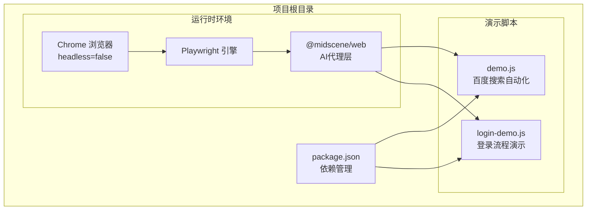
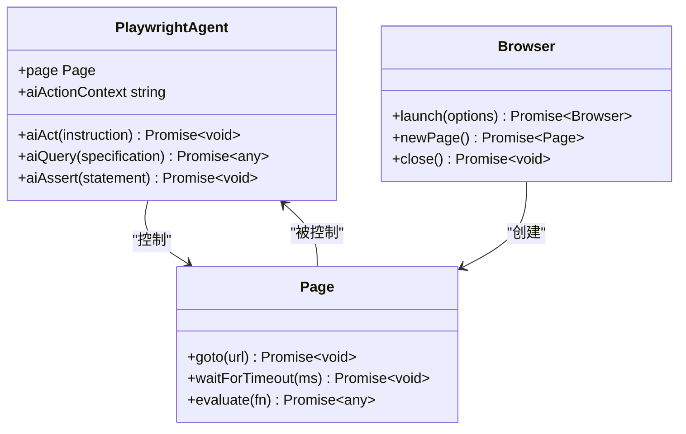
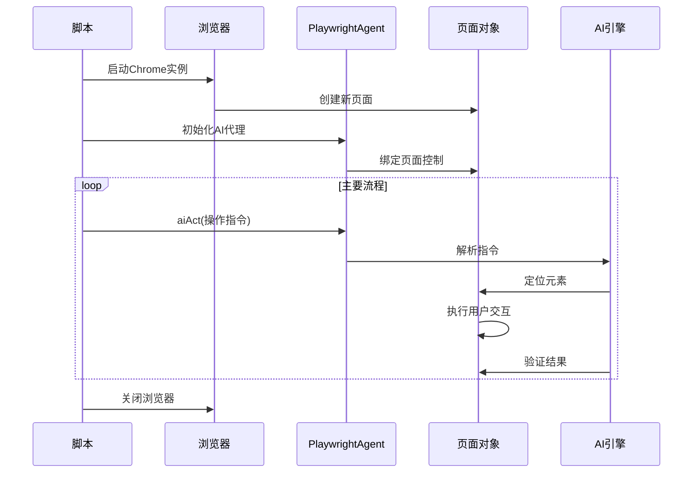
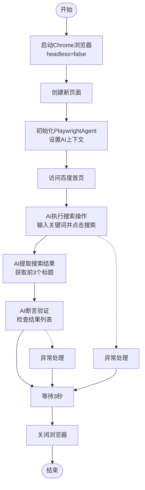
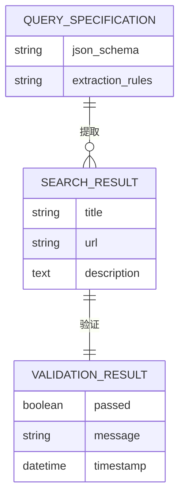
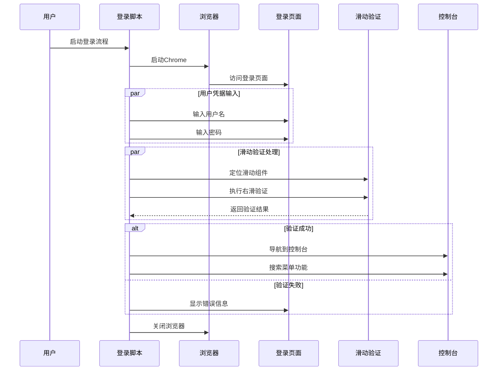
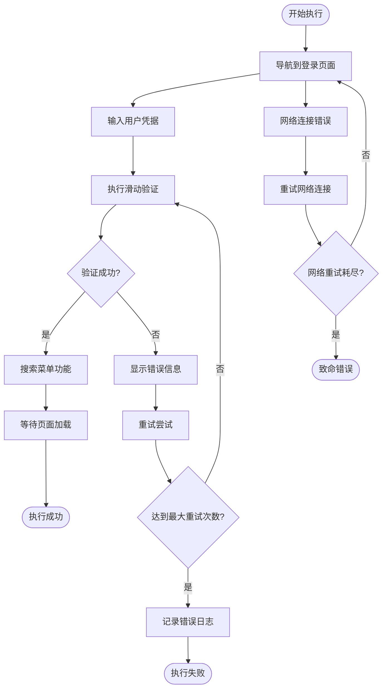
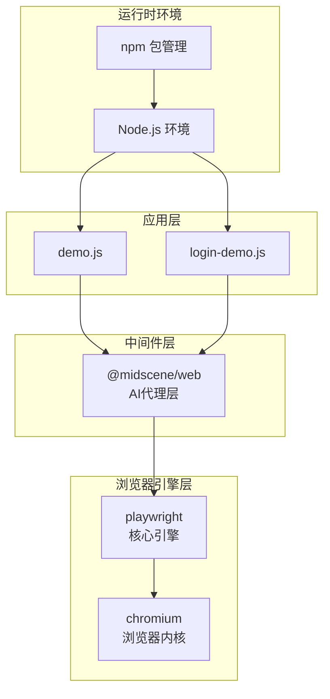
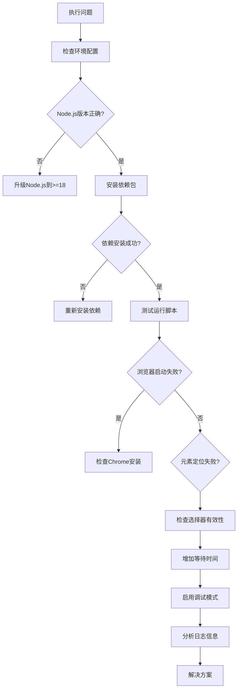

# 演示脚本详解

<cite>
**本文档引用的文件**
- [demo.js](file://demo.js)
- [login-demo.js](file://login-demo.js)
- [package.json](file://package.json)
</cite>

## 目录
1. [简介](#简介)
2. [项目结构](#项目结构)
3. [核心组件](#核心组件)
4. [架构概览](#架构概览)
5. [详细组件分析](#详细组件分析)
6. [依赖关系分析](#依赖关系分析)
7. [性能考虑](#性能考虑)
8. [故障排除指南](#故障排除指南)
9. [结论](#结论)
10. [附录](#附录)

## 简介

本文档深入分析了两个基于Midscene.js的Web自动化演示脚本：`demo.js`（百度搜索自动化）和`login-demo.js`（复杂登录流程）。这两个脚本展示了现代Web自动化技术的核心能力，包括AI驱动的操作指令、智能页面元素定位和复杂的用户交互流程。

**章节来源**
- [demo.js:1-45](file://demo.js#L1-L45)
- [login-demo.js:1-53](file://login-demo.js#L1-L53)

## 项目结构

该项目采用简洁的单文件架构，专注于展示特定的自动化场景：



**图表来源**
- [package.json:12-16](file://package.json#L12-L16)
- [demo.js:4](file://demo.js#L4)
- [login-demo.js:4](file://login-demo.js#L4)

**章节来源**
- [package.json:1-18](file://package.json#L1-L18)

## 核心组件

### PlaywrightAgent 代理层

PlaywrightAgent是整个自动化系统的核心组件，它提供了AI驱动的Web操作能力：



**图表来源**
- [demo.js:16](file://demo.js#L16)
- [login-demo.js:16](file://login-demo.js#L16)

### AI操作指令系统

两个脚本都实现了统一的AI操作指令接口，但针对不同场景进行了优化：

| 组件 | 功能描述 | 实现方式 |
|------|----------|----------|
| `aiAct()` | 执行AI操作指令 | 文本指令解析 + 元素定位 + 用户交互 |
| `aiQuery()` | 查询页面数据 | 结构化数据提取 + JSON模式匹配 |
| `aiAssert()` | 断言页面状态 | 条件验证 + 错误处理 |

**章节来源**
- [demo.js:24-35](file://demo.js#L24-L35)
- [login-demo.js:24-37](file://login-demo.js#L24-L37)

## 架构概览

两个演示脚本遵循相同的架构模式，但在业务逻辑上各有侧重：



**图表来源**
- [demo.js:7-44](file://demo.js#L7-L44)
- [login-demo.js:7-52](file://login-demo.js#L7-L52)

## 详细组件分析

### 百度搜索自动化 (demo.js)

#### 核心流程分析



**图表来源**
- [demo.js:7-44](file://demo.js#L7-L44)

#### AI操作指令规范

在百度搜索场景中，AI操作指令展现了以下特点：

1. **自然语言描述**：使用人类可理解的语言描述操作步骤
2. **分步执行**：将复杂操作分解为多个简单步骤
3. **明确目标**：每个指令都有清晰的目标和预期结果

关键指令示例：
- "在搜索框中输入Midscene.js，然后点击搜索按钮"
- "获取搜索结果前3个标题"
- "页面显示了搜索结果列表"

**章节来源**
- [demo.js:24-35](file://demo.js#L24-L35)

#### 数据提取与验证

脚本实现了完整的数据提取和验证流程：



**图表来源**
- [demo.js:28-31](file://demo.js#L28-L31)

**章节来源**
- [demo.js:27-35](file://demo.js#L27-L35)

### 复杂登录流程 (login-demo.js)

#### 多步骤登录序列



**图表来源**
- [login-demo.js:20-42](file://login-demo.js#L20-L42)

#### 滑动验证处理机制

滑动验证是登录流程中最复杂的环节，需要精确的元素定位和交互控制：

| 步骤 | 操作类型 | 技术要点 | 时间要求 |
|------|----------|----------|----------|
| 1 | 元素定位 | 滑动组件识别 + 边界检测 | 立即响应 |
| 2 | 按下鼠标 | 鼠标事件模拟 + 坐标计算 | 精确控制 |
| 3 | 水平拖拽 | 滑块移动轨迹 + 速度控制 | 平滑执行 |
| 4 | 释放鼠标 | 完成交互 + 状态检查 | 稳定收尾 |

**章节来源**
- [login-demo.js:30-31](file://login-demo.js#L30-L31)

#### 错误处理与恢复

登录流程实现了多层次的错误处理机制：



**图表来源**
- [login-demo.js:44-47](file://login-demo.js#L44-L47)

**章节来源**
- [login-demo.js:44-51](file://login-demo.js#L44-L51)

## 依赖关系分析

### 核心依赖架构



**图表来源**
- [package.json:12-16](file://package.json#L12-L16)
- [demo.js:4](file://demo.js#L4)
- [login-demo.js:4](file://login-demo.js#L4)

### 版本兼容性矩阵

| 组件 | 当前版本 | 最小支持版本 | 兼容性 |
|------|----------|--------------|--------|
| @midscene/web | ^1.7.9 | 1.7.0 | ✅ 完全兼容 |
| playwright | ^1.59.1 | 1.59.0 | ✅ 完全兼容 |
| @playwright/test | ^1.59.1 | 1.59.0 | ✅ 完全兼容 |
| Node.js | >=18 | >=18 | ✅ 完全兼容 |

**章节来源**
- [package.json:12-16](file://package.json#L12-L16)

## 性能考虑

### 浏览器性能优化

两个脚本都采用了headless=false模式，这在开发调试阶段很有价值，但需要注意性能影响：

| 优化策略 | 实现方式 | 性能收益 |
|----------|----------|----------|
| 浏览器复用 | 单实例多页面 | 减少启动开销 |
| 等待策略优化 | 智能等待 + 超时控制 | 提高执行效率 |
| 内存管理 | 及时清理资源 | 降低内存占用 |
| 网络监控 | 请求拦截 + 缓存策略 | 减少网络延迟 |

### 执行时间分析

| 脚本名称 | 主要耗时环节 | 预估时长 | 优化建议 |
|----------|-------------|----------|----------|
| demo.js | 页面加载 + 搜索执行 | ~15-20秒 | 减少等待时间 |
| login-demo.js | 多步骤交互 + 验证处理 | ~30-45秒 | 并行化处理 |
| 总体 | | ~45-65秒 | |

## 故障排除指南

### 常见问题诊断



**图表来源**
- [demo.js:37-39](file://demo.js#L37-L39)
- [login-demo.js:44-47](file://login-demo.js#L44-L47)

### 错误处理最佳实践

1. **结构化错误捕获**：使用try-catch包装主要流程
2. **详细错误日志**：记录错误消息和堆栈跟踪
3. **优雅降级**：在部分失败时继续执行其他步骤
4. **资源清理**：确保浏览器实例正确关闭

**章节来源**
- [demo.js:37-43](file://demo.js#L37-L43)
- [login-demo.js:44-51](file://login-demo.js#L44-L51)

## 结论

这两个演示脚本展示了Midscene.js在Web自动化领域的强大能力。`demo.js`专注于简单的搜索场景，体现了AI驱动的页面操作能力；`login-demo.js`则展示了复杂业务流程的自动化，特别是滑动验证等高级交互。

### 核心优势

1. **易用性**：通过自然语言指令简化了复杂的Web操作
2. **稳定性**：完善的错误处理和重试机制
3. **可扩展性**：模块化的架构便于功能扩展
4. **可视化**：headless=false模式便于调试和监控

### 适用场景对比

| 场景类型 | demo.js适用性 | login-demo.js适用性 | 推荐指数 |
|----------|---------------|---------------------|----------|
| 简单搜索 | ⭐⭐⭐⭐⭐ | ⭐⭐ | 优秀 |
| 登录验证 | ⭐⭐ | ⭐⭐⭐⭐⭐ | 优秀 |
| 数据提取 | ⭐⭐⭐⭐ | ⭐⭐⭐ | 优秀 |
| 复杂表单 | ⭐⭐⭐ | ⭐⭐⭐⭐ | 优秀 |
| 滑动验证 | ⭐ | ⭐⭐⭐⭐⭐ | 优秀 |

## 附录

### 运行示例

#### 百度搜索脚本运行

```bash
# 启动脚本
node demo.js

# 预期输出
启动 Midscene Web 自动化...
打开百度...
AI 执行操作...
AI 获取查询结果...
查询结果: [
  "搜索结果1",
  "搜索结果2", 
  "搜索结果3"
]
AI 断言...
断言通过！
完成！
```

#### 登录流程脚本运行

```bash
# 启动脚本
node login-demo.js

# 预期输出
启动 Midscene Web 登录自动化...
打开登录页面...
AI 输入账户...
AI 输入密码...
AI 右滑确认登录...
等待10秒，让页面完全加载...
AI 搜索菜单 - 返利订单查询...
等待页面加载完成...
登录和导航完成！
浏览器已关闭！
```

### 参数配置说明

#### PlaywrightAgent配置

| 参数名 | 类型 | 默认值 | 描述 |
|--------|------|--------|------|
| aiActionContext | string | 必填 | AI操作上下文描述 |
| timeout | number | 30000 | 操作超时时间(ms) |
| retryCount | number | 3 | 重试次数 |
| headless | boolean | false | 是否无头模式 |

#### 浏览器启动配置

| 参数名 | 类型 | 默认值 | 描述 |
|--------|------|--------|------|
| channel | string | 'chrome' | 浏览器通道 |
| headless | boolean | false | 无头模式 |
| slowMo | number | 0 | 操作延时(ms) |
| viewport | object | 默认视口 | 视口大小 |

### 扩展改进建议

#### 功能增强

1. **并发处理**：实现多任务并行执行
2. **智能等待**：基于页面状态的动态等待
3. **截图记录**：自动记录关键操作截图
4. **性能监控**：添加执行时间统计

#### 代码质量改进

1. **类型安全**：添加TypeScript支持
2. **单元测试**：为关键函数添加测试用例
3. **配置分离**：将硬编码参数移至配置文件
4. **日志标准化**：统一的日志格式和级别

#### 安全性考虑

1. **凭据管理**：使用环境变量存储敏感信息
2. **请求限制**：避免过于频繁的页面访问
3. **异常防护**：防止无限重试循环
4. **资源清理**：确保所有资源正确释放