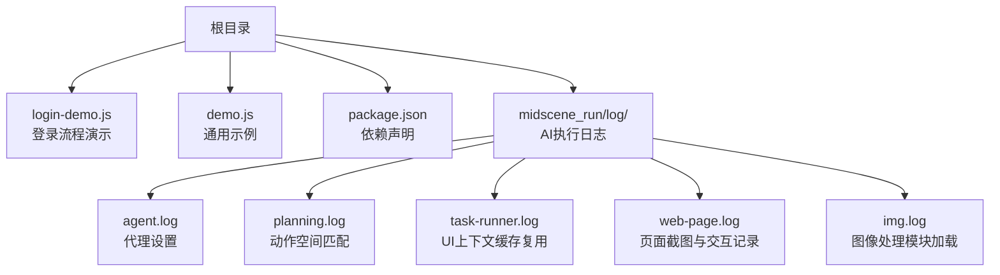
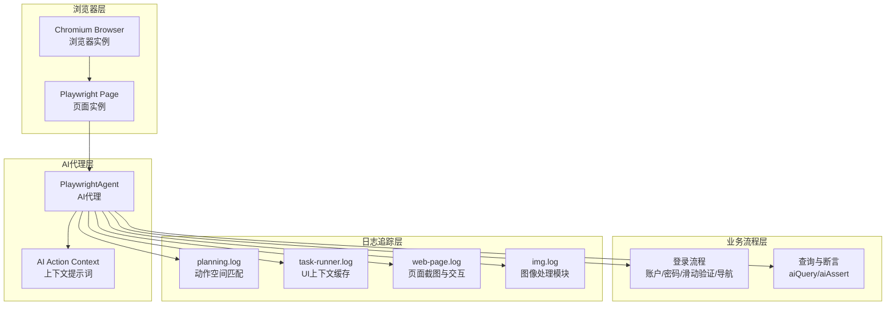
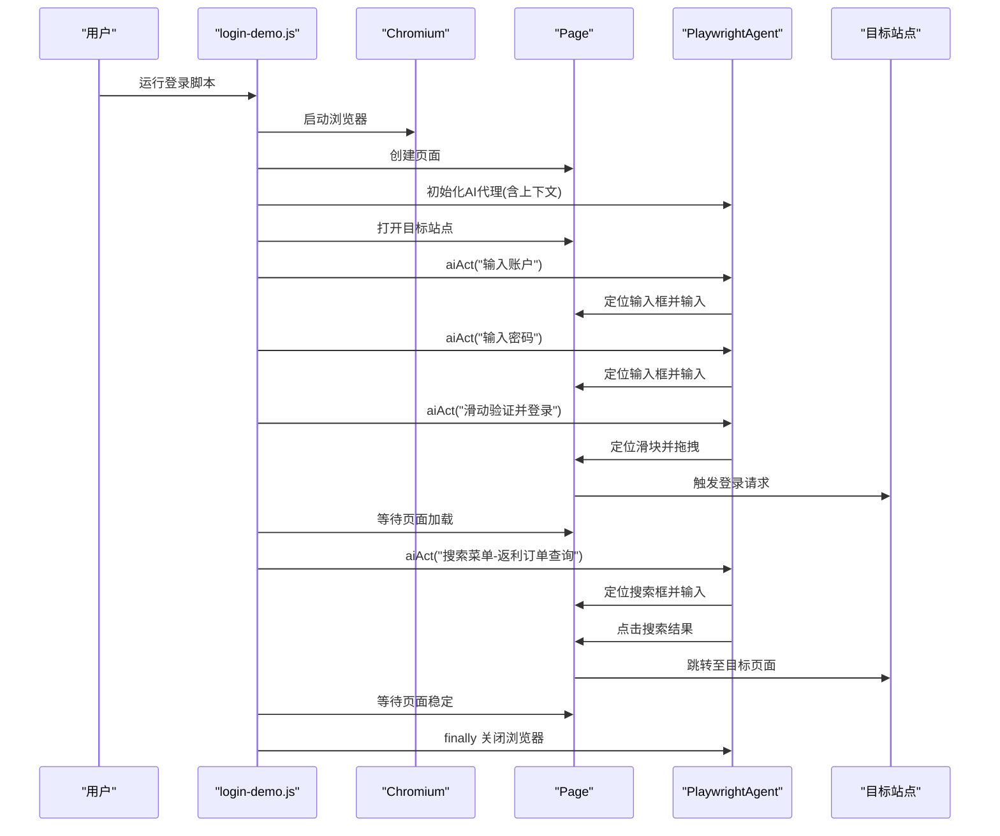
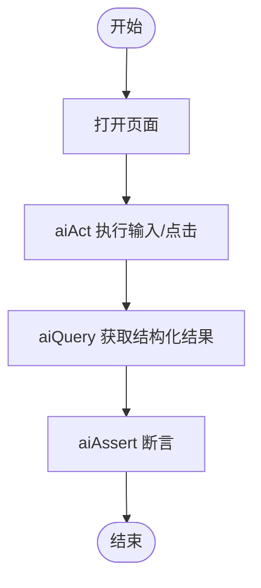
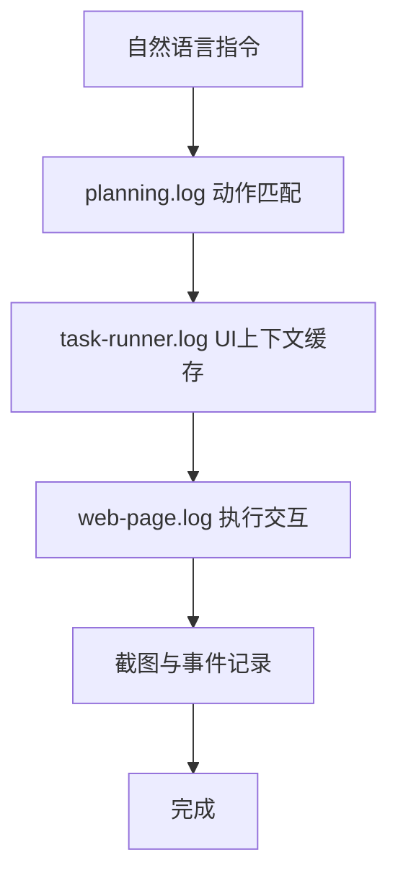
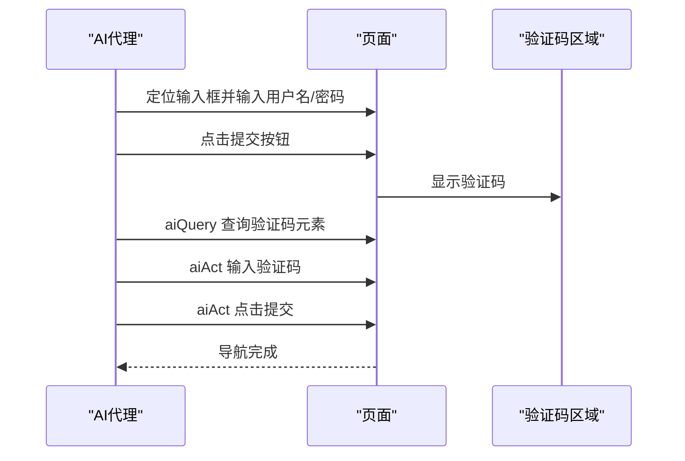
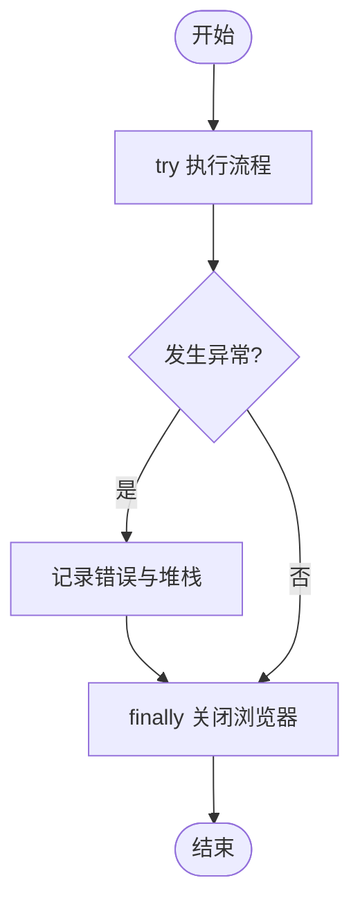
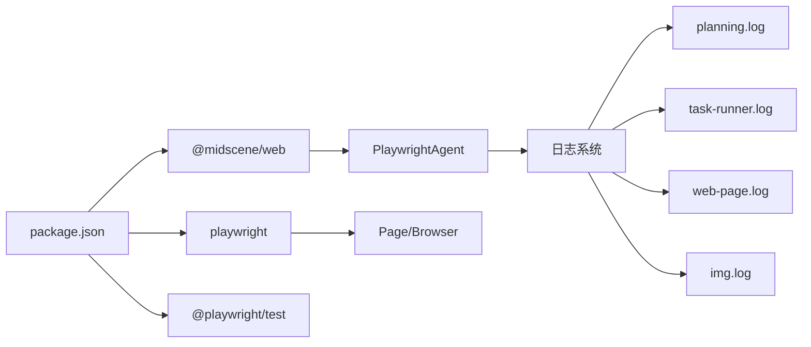

# 登录流程演示

<cite>
**本文引用的文件**
- [login-demo.js](file://login-demo.js)
- [demo.js](file://demo.js)
- [package.json](file://package.json)
- [agent.log](file://midscene_run/log/agent.log)
- [planning.log](file://midscene_run/log/planning.log)
- [task-runner.log](file://midscene_run/log/task-runner.log)
- [web-page.log](file://midscene_run/log/web-page.log)
- [img.log](file://midscene_run/log/img.log)
</cite>

## 目录
1. [简介](#简介)
2. [项目结构](#项目结构)
3. [核心组件](#核心组件)
4. [架构总览](#架构总览)
5. [详细组件分析](#详细组件分析)
6. [依赖关系分析](#依赖关系分析)
7. [性能考虑](#性能考虑)
8. [故障排查指南](#故障排查指南)
9. [结论](#结论)
10. [附录](#附录)

## 简介
本技术文档围绕登录流程自动化演示脚本展开，重点解析 login-demo.js 中的复杂交互场景：多步骤导航流程、滑动验证处理与用户认证过程；同时说明如何编写与执行复杂 AI 操作指令，解释登录表单处理机制（用户名/密码输入、验证码识别与提交）、错误处理与异常恢复策略（网络超时、验证码失败等），并提供运行示例、调试技巧、性能优化与扩展建议。

## 项目结构
该项目采用“演示脚本 + 日志输出”的轻量级组织方式：
- 根目录包含两个演示脚本：login-demo.js（登录流程）与 demo.js（通用示例）
- 依赖管理通过 package.json 声明
- midscene_run/log 下存放 AI 执行过程产生的日志，便于定位动作规划与页面交互细节

**图表来源**
- [login-demo.js:1-53](file://login-demo.js#L1-L53)
- [demo.js:1-45](file://demo.js#L1-L45)
- [package.json:1-18](file://package.json#L1-L18)
- [agent.log:1-3](file://midscene_run/log/agent.log#L1-L3)
- [planning.log:1-200](file://midscene_run/log/planning.log#L1-L200)
- [task-runner.log:1-35](file://midscene_run/log/task-runner.log#L1-L35)
- [web-page.log:1-120](file://midscene_run/log/web-page.log#L1-L120)
- [img.log:1-5](file://midscene_run/log/img.log#L1-L5)

**章节来源**
- [login-demo.js:1-53](file://login-demo.js#L1-L53)
- [demo.js:1-45](file://demo.js#L1-L45)
- [package.json:1-18](file://package.json#L1-L18)

## 核心组件
- 浏览器驱动与页面实例：使用 Playwright 的 Chromium 启动无头或有头浏览器，创建新页面用于自动化操作
- AI 代理（PlaywrightAgent）：封装页面操作能力，支持 AI 动作调用（aiAct）、查询（aiQuery）、断言（aiAssert）
- 日志系统：Midscene 提供的多类日志，覆盖动作规划、任务执行、页面交互与图像处理等环节

关键职责划分：
- login-demo.js：定义登录与导航流程，调用 AI 代理执行复杂交互
- demo.js：展示通用 AI 操作模式（输入、查询、断言）
- 日志：辅助定位 AI 规划与页面交互的执行路径

**章节来源**
- [login-demo.js:7-18](file://login-demo.js#L7-L18)
- [demo.js:7-18](file://demo.js#L7-L18)
- [agent.log:1-3](file://midscene_run/log/agent.log#L1-L3)
- [planning.log:1-200](file://midscene_run/log/planning.log#L1-L200)
- [task-runner.log:1-35](file://midscene_run/log/task-runner.log#L1-L35)
- [web-page.log:1-120](file://midscene_run/log/web-page.log#L1-L120)
- [img.log:1-5](file://midscene_run/log/img.log#L1-L5)

## 架构总览
下图展示了登录流程的端到端架构：浏览器驱动、AI 代理、页面交互与日志追踪之间的关系。

**图表来源**
- [login-demo.js:10-18](file://login-demo.js#L10-L18)
- [demo.js:10-18](file://demo.js#L10-L18)
- [planning.log:1-200](file://midscene_run/log/planning.log#L1-L200)
- [task-runner.log:1-35](file://midscene_run/log/task-runner.log#L1-L35)
- [web-page.log:1-120](file://midscene_run/log/web-page.log#L1-L120)
- [img.log:1-5](file://midscene_run/log/img.log#L1-L5)

## 详细组件分析

### 登录流程组件（login-demo.js）
- 启动与初始化
  - 启动 Chromium 浏览器（可选择有头模式）
  - 创建页面实例
  - 初始化 PlaywrightAgent 并注入 AI 动作上下文
- 页面访问与登录
  - 访问目标站点
  - AI 输入账户与密码
  - AI 执行滑动验证并登录
  - 等待页面稳定后进行导航
- 导航与查询
  - 在左侧菜单搜索“返利订单查询”，进入对应页面
- 错误处理与收尾
  - try/catch 捕获异常并打印堆栈
  - finally 关闭浏览器并输出状态

**图表来源**
- [login-demo.js:7-51](file://login-demo.js#L7-L51)
- [web-page.log:1-120](file://midscene_run/log/web-page.log#L1-L120)

**章节来源**
- [login-demo.js:7-51](file://login-demo.js#L7-L51)

### 通用示例组件（demo.js）
- 展示了更通用的 AI 操作模式：
  - 打开指定页面
  - 使用 aiAct 执行输入与点击
  - 使用 aiQuery 获取结构化结果
  - 使用 aiAssert 进行断言
- 适用于快速验证 AI 代理在不同页面上的行为一致性

**图表来源**
- [demo.js:7-43](file://demo.js#L7-L43)

**章节来源**
- [demo.js:7-43](file://demo.js#L7-L43)

### AI 动作规划与执行（日志分析）
- 动作空间匹配
  - planning.log 显示 AI 将自然语言指令映射到具体动作（如 Tap、Input），并记录参数校验与样本调用
- UI 上下文缓存
  - task-runner.log 展示 UI 上下文被频繁复用，减少重复截图与定位成本
- 页面交互与截图
  - web-page.log 记录截图时间点、鼠标移动/点击、键盘输入、拖拽与导航等待等关键事件
- 图像处理模块
  - img.log 显示图像处理模块按需加载，支撑视觉定位与识别

**图表来源**
- [planning.log:1-200](file://midscene_run/log/planning.log#L1-L200)
- [task-runner.log:1-35](file://midscene_run/log/task-runner.log#L1-L35)
- [web-page.log:1-120](file://midscene_run/log/web-page.log#L1-L120)
- [img.log:1-5](file://midscene_run/log/img.log#L1-L5)

**章节来源**
- [planning.log:1-200](file://midscene_run/log/planning.log#L1-L200)
- [task-runner.log:1-35](file://midscene_run/log/task-runner.log#L1-L35)
- [web-page.log:1-120](file://midscene_run/log/web-page.log#L1-L120)
- [img.log:1-5](file://midscene_run/log/img.log#L1-L5)

### 登录表单处理机制
- 用户名/密码输入
  - 通过 aiAct 指令定位输入框并输入，随后触发页面导航等待
- 验证码识别与提交
  - 本脚本未直接展示验证码识别逻辑，但可通过 aiQuery/aiAssert 对验证码区域进行结构化查询与断言，结合 aiAct 执行点击或输入
- 提交流程
  - aiAct 指令触发点击或输入后，等待导航完成，确保页面稳定后再继续下一步

**图表来源**
- [login-demo.js:24-31](file://login-demo.js#L24-L31)
- [demo.js:28-35](file://demo.js#L28-L35)

**章节来源**
- [login-demo.js:24-31](file://login-demo.js#L24-L31)
- [demo.js:28-35](file://demo.js#L28-L35)

### 复杂 AI 操作指令编写与执行策略
- 指令风格
  - 使用“在...中输入/点击/拖拽”等自然语言描述，明确目标元素与动作
  - 对于滑动验证，强调方向与目标（如“向右滑动滑块完成验证并登录”）
- 执行策略
  - 先定位再执行，利用 UI 上下文缓存减少重复定位
  - 对关键动作后增加等待导航完成，避免竞态条件
  - 对复杂场景（如验证码）先查询结构化信息，再执行后续动作

**章节来源**
- [login-demo.js:24-31](file://login-demo.js#L24-L31)
- [planning.log:1-200](file://midscene_run/log/planning.log#L1-L200)
- [task-runner.log:1-35](file://midscene_run/log/task-runner.log#L1-L35)

### 错误处理与异常恢复机制
- 网络超时
  - 页面导航等待期间可能出现超时，应在外层 try/catch 捕获并记录堆栈
- 验证码失败
  - 可通过 aiQuery 获取验证码元素状态，若失败则重试或回退到备用方案
- 异常恢复
  - finally 中统一关闭浏览器，确保资源释放
  - 建议在关键步骤增加重试与降级策略（例如重试输入、刷新页面）

**图表来源**
- [login-demo.js:44-51](file://login-demo.js#L44-L51)

**章节来源**
- [login-demo.js:44-51](file://login-demo.js#L44-L51)

## 依赖关系分析
- 依赖声明
  - @midscene/web：提供 AI 代理与动作接口
  - playwright：提供浏览器驱动与页面操作能力
  - @playwright/test：测试框架（可选）
- 日志依赖
  - planning.log、task-runner.log、web-page.log、img.log 等日志文件共同支撑 AI 行为的可观测性

**图表来源**
- [package.json:12-16](file://package.json#L12-L16)
- [agent.log:1-3](file://midscene_run/log/agent.log#L1-L3)
- [planning.log:1-200](file://midscene_run/log/planning.log#L1-L200)
- [task-runner.log:1-35](file://midscene_run/log/task-runner.log#L1-L35)
- [web-page.log:1-120](file://midscene_run/log/web-page.log#L1-L120)
- [img.log:1-5](file://midscene_run/log/img.log#L1-L5)

**章节来源**
- [package.json:12-16](file://package.json#L12-L16)

## 性能考虑
- UI 上下文缓存复用
  - 通过 task-runner.log 可见 UI 上下文被频繁复用，显著降低截图与定位成本
- 截图与交互耗时
  - web-page.log 记录了截图与交互的耗时，建议在保证定位准确的前提下减少不必要的截图
- 动作规划效率
  - planning.log 展示动作空间匹配与参数校验，保持指令简洁有助于提升匹配速度
- 图像处理模块
  - img.log 显示模块按需加载，避免不必要的初始化开销

**章节来源**
- [task-runner.log:1-35](file://midscene_run/log/task-runner.log#L1-L35)
- [web-page.log:1-120](file://midscene_run/log/web-page.log#L1-L120)
- [img.log:1-5](file://midscene_run/log/img.log#L1-L5)

## 故障排查指南
- 常见问题定位
  - 动作未命中：检查 planning.log 中的动作匹配与参数校验
  - 定位失败：关注 UI 上下文是否过期，必要时刷新或重新截图
  - 交互异常：查看 web-page.log 中的截图时间点与交互序列
- 日志分析要点
  - agent.log：代理设置与模型开关
  - planning.log：动作空间匹配与参数校验
  - task-runner.log：UI 上下文缓存复用频率
  - web-page.log：截图、鼠标/键盘事件、导航等待
  - img.log：图像处理模块加载状态

**章节来源**
- [agent.log:1-3](file://midscene_run/log/agent.log#L1-L3)
- [planning.log:1-200](file://midscene_run/log/planning.log#L1-L200)
- [task-runner.log:1-35](file://midscene_run/log/task-runner.log#L1-L35)
- [web-page.log:1-120](file://midscene_run/log/web-page.log#L1-L120)
- [img.log:1-5](file://midscene_run/log/img.log#L1-L5)

## 结论
login-demo.js 通过 PlaywrightAgent 将自然语言指令转化为精确的页面操作，实现了从登录到导航的完整自动化流程。借助丰富的日志体系，可以高效定位动作规划与页面交互问题。建议在实际生产环境中引入重试、降级与可视化监控，以进一步提升稳定性与可观测性。

## 附录
- 运行示例
  - 登录流程：运行 login-demo.js，观察控制台输出与浏览器界面交互
  - 通用示例：运行 demo.js，体验 aiAct/aiQuery/aiAssert 的组合使用
- 调试技巧
  - 结合日志文件定位问题：先看 planning.log 再看 task-runner.log，最后核对 web-page.log
  - 控制台输出与日志时间戳对齐，快速定位异常发生点
- 性能优化建议
  - 减少不必要的截图与导航等待
  - 利用 UI 上下文缓存，避免重复定位
  - 简化指令描述，提高动作匹配效率
- 扩展改进建议
  - 增加验证码识别与容错处理
  - 引入重试与降级策略，增强鲁棒性
  - 添加可视化报告与监控告警