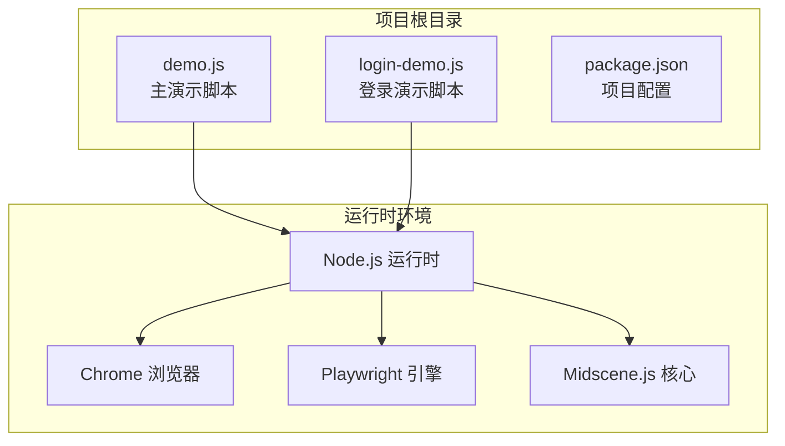
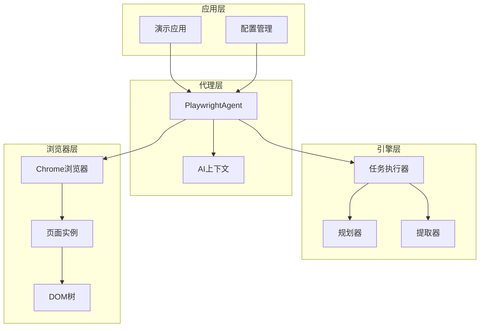
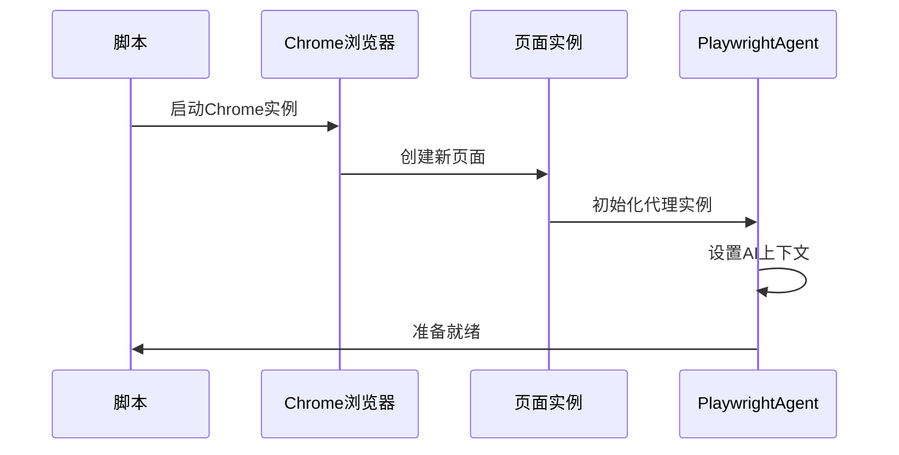
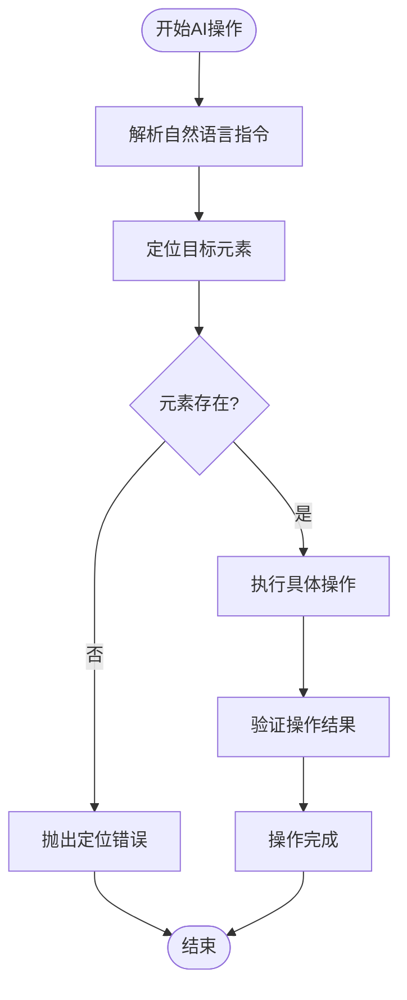
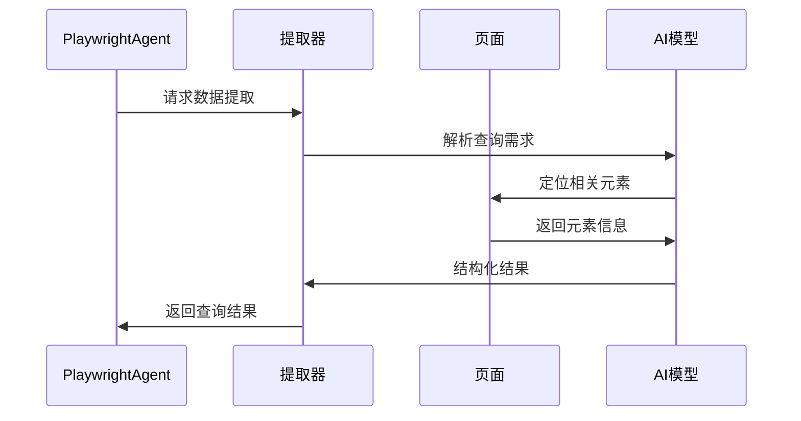
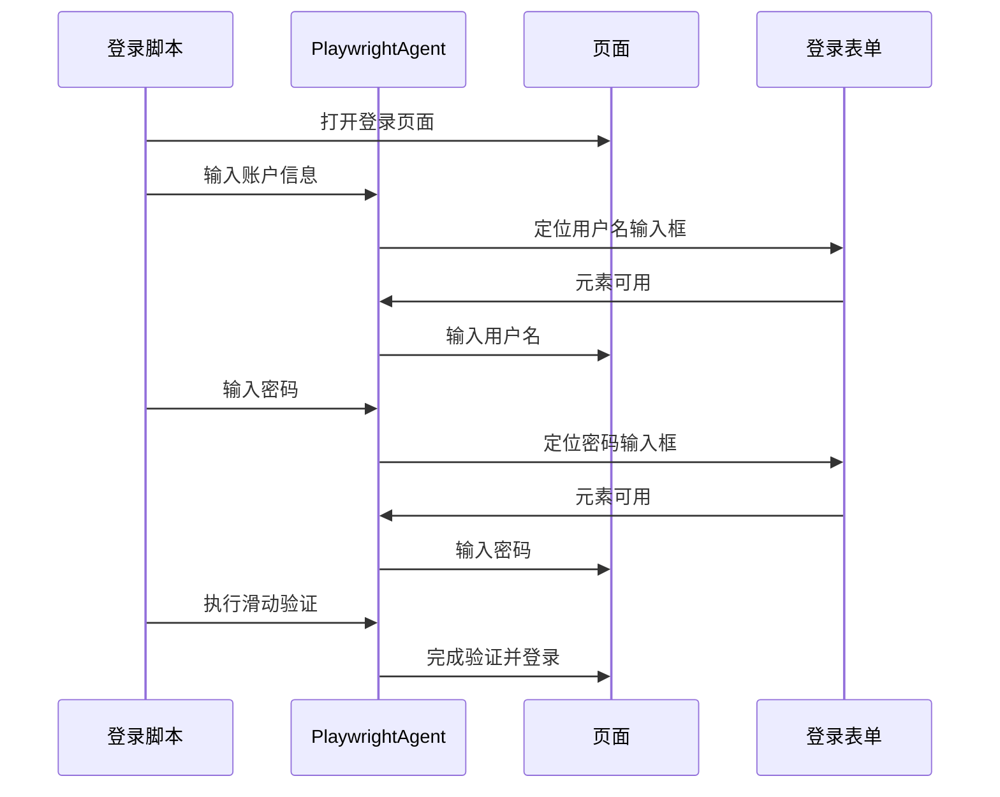
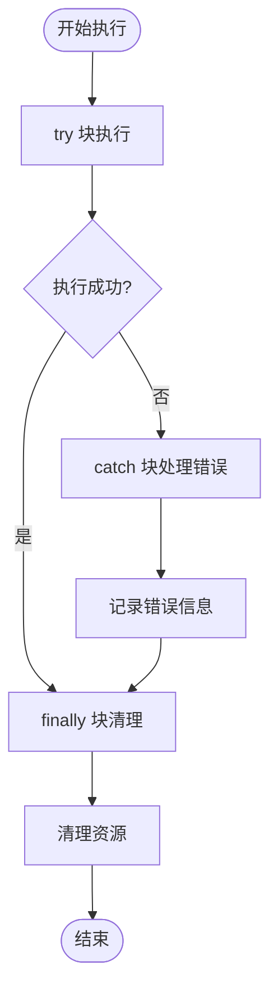

# 百度搜索演示

<cite>
**本文档引用的文件**
- [demo.js](file://demo.js)
- [login-demo.js](file://login-demo.js)
- [package.json](file://package.json)
</cite>

## 目录
1. [简介](#简介)
2. [项目结构](#项目结构)
3. [核心组件](#核心组件)
4. [架构概览](#架构概览)
5. [详细组件分析](#详细组件分析)
6. [依赖关系分析](#依赖关系分析)
7. [性能考虑](#性能考虑)
8. [故障排除指南](#故障排除指南)
9. [结论](#结论)

## 简介

本项目是一个基于Midscene.js的百度搜索自动化演示脚本，展示了如何使用AI驱动的网页自动化技术来执行复杂的用户交互任务。该演示脚本利用Playwright作为底层浏览器引擎，结合Midscene.js的智能代理功能，实现了从页面导航到数据提取的完整自动化流程。

项目的核心特色包括：
- AI驱动的操作执行（aiAct）
- 结构化数据查询（aiQuery）  
- 智能断言验证（aiAssert）
- 基于上下文的浏览器控制

## 项目结构

该项目采用简洁的单文件架构设计，主要包含以下核心文件：



**图表来源**
- [demo.js:1-45](file://demo.js#L1-L45)
- [login-demo.js:1-53](file://login-demo.js#L1-L53)
- [package.json:1-18](file://package.json#L1-L18)

**章节来源**
- [demo.js:1-45](file://demo.js#L1-L45)
- [login-demo.js:1-53](file://login-demo.js#L1-L53)
- [package.json:1-18](file://package.json#L1-L18)

## 核心组件

### PlaywrightAgent 代理类

PlaywrightAgent是整个自动化系统的核心组件，负责协调AI操作、页面交互和数据提取。其主要职责包括：

- **浏览器实例管理**：封装Playwright的browser和page对象
- **AI操作执行**：通过aiAct()方法执行自然语言描述的操作
- **数据查询提取**：通过aiQuery()方法提取结构化数据
- **断言验证**：通过aiAssert()方法验证页面状态

### 浏览器实例配置

系统使用Chrome浏览器作为默认执行环境，配置特点包括：
- 使用Chrome通道确保兼容性
- 非无头模式便于调试和可视化
- 支持本地Chrome安装

**章节来源**
- [demo.js:10-18](file://demo.js#L10-L18)
- [login-demo.js:10-18](file://login-demo.js#L10-L18)

## 架构概览

整个系统采用分层架构设计，从上到下分为应用层、代理层、引擎层和浏览器层：



**图表来源**
- [demo.js:4-5](file://demo.js#L4-L5)
- [demo.js:16-18](file://demo.js#L16-L18)

## 详细组件分析

### 主演示脚本分析

#### 初始化流程

演示脚本遵循标准的初始化模式：



**图表来源**
- [demo.js:7-18](file://demo.js#L7-L18)

#### AI操作执行流程

aiAct()方法负责将自然语言指令转换为具体的浏览器操作：



**图表来源**
- [demo.js:24-25](file://demo.js#L24-L25)

#### 数据查询与提取

aiQuery()方法支持结构化数据提取：



**图表来源**
- [demo.js:27-31](file://demo.js#L27-L31)

**章节来源**
- [demo.js:7-44](file://demo.js#L7-L44)

### 登录演示脚本分析

登录演示展示了更复杂的工作流场景：

#### 多步骤操作序列



**图表来源**
- [login-demo.js:20-37](file://login-demo.js#L20-L37)

**章节来源**
- [login-demo.js:7-52](file://login-demo.js#L7-L52)

## 依赖关系分析

### 核心依赖关系

项目依赖关系清晰明确，主要包含三个核心包：

```mermaid
graph LR
subgraph "项目依赖"
Demo[demo.js]
LoginDemo[login-demo.js]
end
subgraph "核心依赖"
Midscene[@midscene/web]
Playwright[playwright]
Test[@playwright/test]
end
Demo --> Midscene
Demo --> Playwright
LoginDemo --> Midscene
LoginDemo --> Playwright
Test --> Playwright
```

**图表来源**
- [package.json:12-16](file://package.json#L12-L16)

### 版本兼容性

根据package.json配置，各依赖包的版本要求：
- Node.js: >= 18 (由Playwright要求)
- @midscene/web: ^1.7.9
- playwright: ^1.59.1
- @playwright/test: ^1.59.1

**章节来源**
- [package.json:1-18](file://package.json#L1-L18)

## 性能考虑

### 浏览器性能优化

1. **非无头模式优势**
   - 便于调试和可视化
   - 更好的错误诊断能力
   - 实时页面状态监控

2. **内存管理**
   - 正确的浏览器实例关闭
   - 及时释放页面资源
   - 避免内存泄漏

3. **网络性能**
   - Chrome通道选择确保最佳兼容性
   - 合理的等待时间设置
   - 避免不必要的重载

### AI操作效率

1. **上下文缓存**
   - AI上下文预设减少重复计算
   - 操作历史记录优化后续执行

2. **元素定位策略**
   - 多层次定位机制
   - 容错处理提升稳定性
   - 缓存常用元素引用

## 故障排除指南

### 常见问题及解决方案

#### 浏览器启动失败

**症状**: Chrome无法启动或启动异常
**可能原因**:
- Chrome未正确安装
- 权限不足
- 端口被占用

**解决方案**:
- 确认Chrome已正确安装
- 以管理员权限运行
- 检查端口占用情况

#### 元素定位失败

**症状**: aiAct()执行时报元素找不到
**可能原因**:
- 页面加载不完全
- 元素选择器过时
- 动态内容加载延迟

**解决方案**:
- 增加适当的等待时间
- 使用更稳定的定位策略
- 实现重试机制

#### AI模型响应异常

**症状**: aiQuery()或aiAssert()执行失败
**可能原因**:
- 网络连接问题
- 模型服务不可用
- 上下文配置错误

**解决方案**:
- 检查网络连接
- 验证AI服务可用性
- 重新设置AI上下文

### 错误处理最佳实践



**图表来源**
- [demo.js:37-43](file://demo.js#L37-L43)
- [login-demo.js:44-51](file://login-demo.js#L44-L51)

**章节来源**
- [demo.js:37-43](file://demo.js#L37-L43)
- [login-demo.js:44-51](file://login-demo.js#L44-L51)

## 结论

本百度搜索自动化演示脚本展示了现代AI驱动网页自动化的强大能力。通过PlaywrightAgent的智能代理架构，系统能够：

1. **简化复杂操作**: 将自然语言指令转换为精确的浏览器操作
2. **结构化数据提取**: 提供类型安全的数据查询接口
3. **智能断言验证**: 确保自动化流程的可靠性
4. **良好的可维护性**: 清晰的代码结构和完善的错误处理

该系统为构建复杂的网页自动化应用提供了优秀的参考模板，特别适合需要智能浏览器控制和数据提取的业务场景。