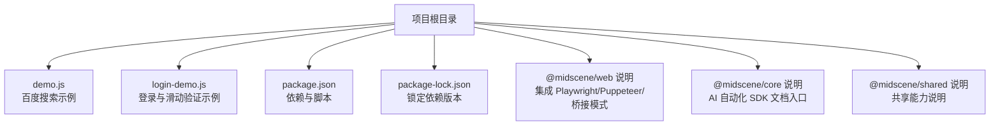
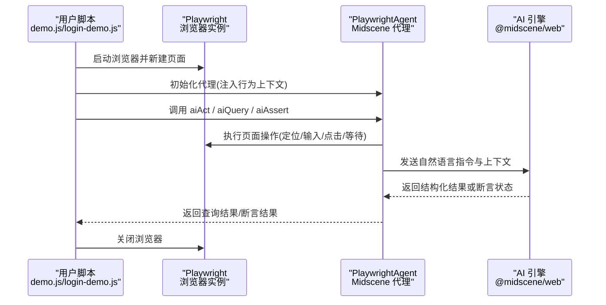
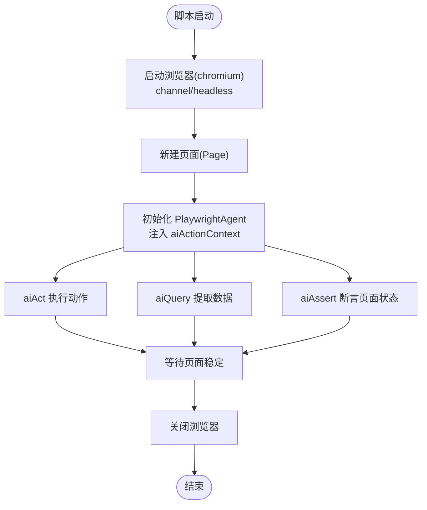
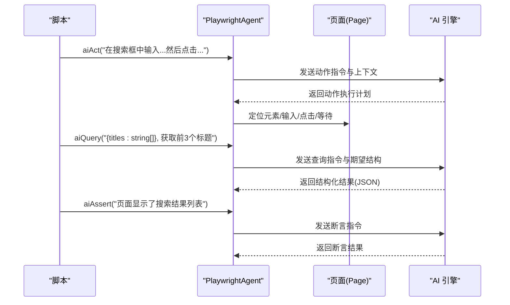
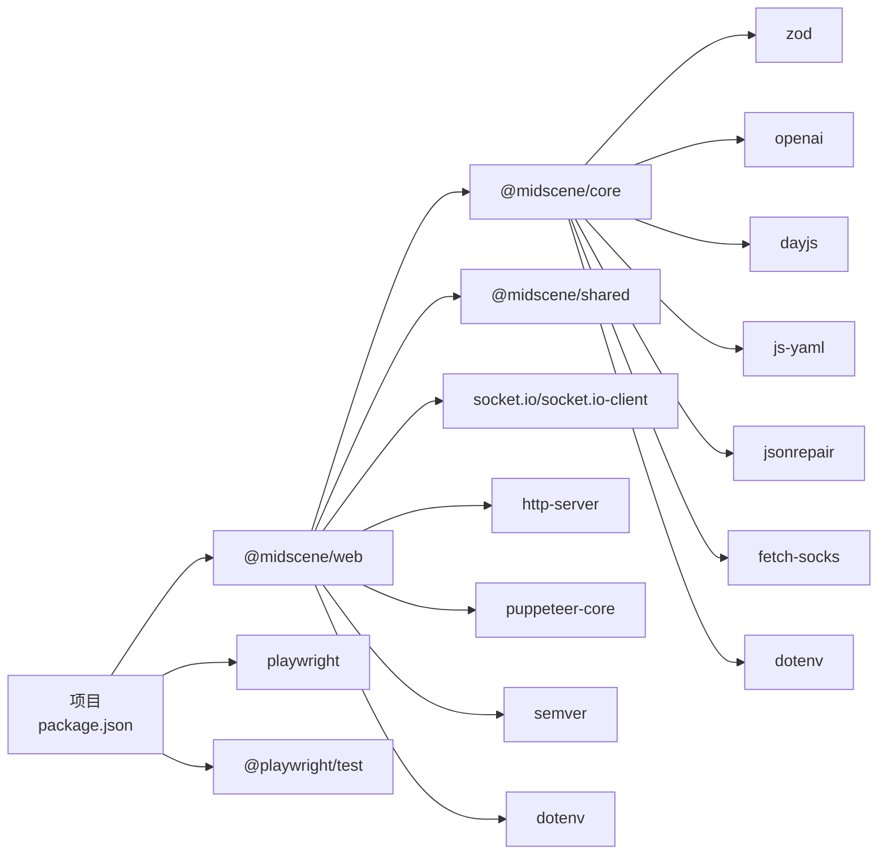

# 配置与定制

<cite>
**本文引用的文件**
- [package.json](file://package.json)
- [package-lock.json](file://package-lock.json)
- [demo.js](file://demo.js)
- [login-demo.js](file://login-demo.js)
- [@midscene/web 说明](file://node_modules/@midscene/web/README.md)
- [@midscene/core 说明](file://node_modules/@midscene/core/README.md)
- [@midscene/shared 说明](file://node_modules/@midscene/shared/README.md)
</cite>

## 目录
1. [简介](#简介)
2. [项目结构](#项目结构)
3. [核心组件](#核心组件)
4. [架构总览](#架构总览)
5. [详细组件分析](#详细组件分析)
6. [依赖关系分析](#依赖关系分析)
7. [性能考虑](#性能考虑)
8. [故障排查指南](#故障排查指南)
9. [结论](#结论)
10. [附录](#附录)

## 简介
本指南面向希望基于 Midscene.js 构建浏览器自动化与数据提取的开发者，围绕以下目标展开：  
- 明确 package.json 中的依赖配置与版本管理策略  
- 解释如何自定义 AI 操作指令与页面元素定位规则  
- 提供浏览器配置选项与性能调优建议  
- 说明环境变量与运行时参数的配置方法  
- 指导如何扩展新的自动化场景与添加自定义功能  
- 总结配置最佳实践与常见问题的解决方案  
- 给出安全配置与生产环境部署注意事项  

## 项目结构
当前示例项目包含两个脚本文件与基础依赖配置，演示了使用 Playwright 与 Midscene 的基本用法。

图表来源
- [demo.js:1-45](file://demo.js#L1-L45)
- [login-demo.js:1-53](file://login-demo.js#L1-L53)
- [package.json:1-18](file://package.json#L1-L18)
- [@midscene/web 说明:1-8](file://node_modules/@midscene/web/README.md#L1-L8)
- [@midscene/core 说明:1-9](file://node_modules/@midscene/core/README.md#L1-L9)
- [@midscene/shared 说明:1-9](file://node_modules/@midscene/shared/README.md#L1-L9)

章节来源
- [package.json:1-18](file://package.json#L1-L18)
- [demo.js:1-45](file://demo.js#L1-L45)
- [login-demo.js:1-53](file://login-demo.js#L1-L53)

## 核心组件
- PlaywrightAgent：封装浏览器控制、AI 动作执行、数据提取与断言的代理对象。  
- 浏览器实例：通过 Playwright 启动 Chromium 并创建页面上下文。  
- AI 行为上下文：通过构造函数参数注入自然语言提示，指导 AI 在特定业务场景下执行动作。  

章节来源
- [demo.js:16-18](file://demo.js#L16-L18)
- [login-demo.js:16-18](file://login-demo.js#L16-L18)

## 架构总览
下图展示了从脚本到浏览器再到 AI 引擎的端到端流程。

图表来源
- [demo.js:7-44](file://demo.js#L7-L44)
- [login-demo.js:7-52](file://login-demo.js#L7-L52)
- [@midscene/web 说明:1-8](file://node_modules/@midscene/web/README.md#L1-L8)

## 详细组件分析

### 组件一：PlaywrightAgent 与浏览器初始化
- 浏览器通道与无头模式：通过启动选项选择 Chrome 渠道与是否无头运行。  
- 页面生命周期：在脚本中统一管理页面打开、操作、等待与关闭。  
- 代理初始化：传入 aiActionContext，用于在执行 aiAct/aiQuery 时提供上下文语义。  

图表来源
- [demo.js:10-18](file://demo.js#L10-L18)
- [login-demo.js:10-18](file://login-demo.js#L10-L18)

章节来源
- [demo.js:10-18](file://demo.js#L10-L18)
- [login-demo.js:10-18](file://login-demo.js#L10-L18)

### 组件二：AI 指令与数据提取
- aiAct：将自然语言动作描述转化为可执行的页面操作序列（如输入、点击、拖拽等）。  
- aiQuery：以自然语言描述期望的数据结构，返回结构化 JSON 结果。  
- aiAssert：对页面状态进行断言，确保自动化流程按预期推进。  

图表来源
- [demo.js:24-35](file://demo.js#L24-L35)
- [login-demo.js:24-31](file://login-demo.js#L24-L31)

章节来源
- [demo.js:24-35](file://demo.js#L24-L35)
- [login-demo.js:24-31](file://login-demo.js#L24-L31)

### 组件三：依赖与版本管理
- 核心依赖：@midscene/web、playwright、@playwright/test。  
- 版本锁定：通过 package-lock.json 锁定各依赖的确切版本，确保复现性与稳定性。  
- 兼容性要求：@midscene/web 对 Node 版本有最低要求；Playwright 与 Puppeteer 均可作为底层驱动。  

章节来源
- [package.json:12-16](file://package.json#L12-L16)
- [package-lock.json:1-16](file://package-lock.json#L1-L16)
- [@midscene/web 说明:1-8](file://node_modules/@midscene/web/README.md#L1-L8)

## 依赖关系分析
下图展示项目与关键依赖之间的关系，以及它们的版本来源。

图表来源
- [package.json:12-16](file://package.json#L12-L16)
- [package-lock.json:492-585](file://package-lock.json#L492-L585)
- [@midscene/web 说明:1-8](file://node_modules/@midscene/web/README.md#L1-L8)

章节来源
- [package.json:12-16](file://package.json#L12-L16)
- [package-lock.json:492-585](file://package-lock.json#L492-L585)

## 性能考虑
- 浏览器启动参数优化
  - 无头模式(headless)：在 CI 或后台任务中建议开启，减少资源占用。  
  - 多进程/沙箱：根据系统资源与隔离需求权衡启用。  
- 页面等待策略
  - 使用显式等待与稳定条件，避免过长的固定超时。  
  - 对动态内容采用“可见/可交互”判断，提升鲁棒性。  
- AI 查询与断言
  - 将复杂查询拆分为多个小步骤，降低单次请求失败概率。  
  - 对结构化输出使用严格模式，减少解析开销。  
- 资源与并发
  - 控制并发浏览器实例数量，避免内存与 CPU 抖动。  
  - 合理回收页面与会话，防止句柄泄漏。  

## 故障排查指南
- 启动失败
  - 检查 Node 版本是否满足 @midscene/web 的最低要求。  
  - 确认 Chrome 可用且与 Playwright 兼容。  
- 页面元素定位失败
  - 使用更稳定的定位策略（如文本匹配、可访问性属性）。  
  - 在关键步骤增加等待与重试逻辑。  
- AI 执行异常
  - 简化自然语言指令，明确上下文与期望输出格式。  
  - 分步调试：先 aiAct 再 aiQuery/aiAssert。  
- 环境变量与网络
  - 如需代理或认证，确保 dotenv 正确加载并传递给底层库。  
- 日志与诊断
  - 在脚本中记录关键步骤与中间结果，便于回溯。  

## 结论
通过合理配置依赖、优化浏览器与 AI 执行策略、规范环境变量与日志，可以显著提升 Midscene.js 自动化脚本的稳定性与可维护性。建议在开发阶段采用分步调试与结构化输出，在生产阶段引入监控与告警机制。

## 附录

### A. 依赖配置与版本管理策略
- 使用语义化版本范围（^）以获得兼容更新，同时通过 package-lock.json 锁定精确版本。  
- 对核心依赖（如 @midscene/web、playwright）保持同步升级节奏，避免版本不匹配导致的行为差异。  
- 在 CI 中使用缓存与只安装生产依赖，缩短构建时间。  

章节来源
- [package.json:12-16](file://package.json#L12-L16)
- [package-lock.json:1-16](file://package-lock.json#L1-L16)

### B. 自定义 AI 操作指令与页面元素定位规则
- 指令风格
  - 使用清晰、可执行的动作描述，避免歧义。  
  - 明确输入/输出约束，例如 aiQuery 的返回结构与字段类型。  
- 定位策略
  - 优先使用稳定的选择器（如可访问性标签、占位符文本）。  
  - 对动态元素增加“存在/可见/可交互”检查。  
- 上下文注入
  - 在初始化 PlaywrightAgent 时提供 aiActionContext，使 AI 更好理解业务场景。  

章节来源
- [demo.js:16-18](file://demo.js#L16-L18)
- [login-demo.js:16-18](file://login-demo.js#L16-L18)

### C. 浏览器配置选项与性能调优
- 启动参数
  - channel：指定 Chrome 渠道（如 chrome）。  
  - headless：是否无头运行。  
- 等待与稳定
  - 在关键步骤后加入等待，确保 DOM 与网络稳定。  
- 资源限制
  - 控制并发与内存上限，避免系统资源耗尽。  

章节来源
- [demo.js:10-13](file://demo.js#L10-L13)
- [login-demo.js:10-13](file://login-demo.js#L10-L13)

### D. 环境变量与运行时参数配置
- 环境变量
  - 使用 dotenv 加载外部配置（如 API 密钥、代理地址），并在脚本中读取。  
- 运行时参数
  - 通过命令行参数或环境变量控制行为（如是否无头、日志级别）。  
- 安全注意
  - 不在代码仓库中提交敏感信息，使用 CI 凭据管理或加密存储。  

章节来源
- [@midscene/web 说明:1-8](file://node_modules/@midscene/web/README.md#L1-L8)
- [package-lock.json:492-509](file://package-lock.json#L492-L509)

### E. 扩展新的自动化场景与自定义功能
- 新场景
  - 基于现有 demo.js 与 login-demo.js 的模式，新增脚本文件，复用 PlaywrightAgent。  
  - 为不同业务场景提供独立的 aiActionContext，提升 AI 执行准确性。  
- 自定义功能
  - 若需扩展底层能力，可在 @midscene/web 的集成边界内进行适配（Playwright/Puppeteer/桥接模式）。  
- 文档与示例
  - 参考官方文档与 README，结合实际业务场景迭代。  

章节来源
- [demo.js:1-45](file://demo.js#L1-L45)
- [login-demo.js:1-53](file://login-demo.js#L1-L53)
- [@midscene/web 说明:1-8](file://node_modules/@midscene/web/README.md#L1-L8)
- [@midscene/core 说明:1-9](file://node_modules/@midscene/core/README.md#L1-L9)
- [@midscene/shared 说明:1-9](file://node_modules/@midscene/shared/README.md#L1-L9)

### F. 安全配置与生产环境部署注意事项
- 最小权限原则
  - 仅授予浏览器与网络访问所需权限，避免过度授权。  
- 代理与网络
  - 在受限网络环境中配置代理，确保 AI 服务可达。  
- 数据保护
  - 避免在日志中输出敏感数据；必要时脱敏处理。  
- 监控与审计
  - 记录关键事件与错误，建立告警机制，定期审查运行报告。