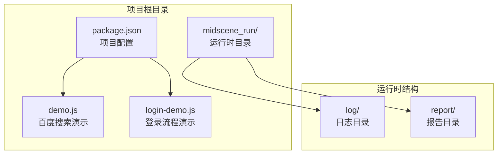
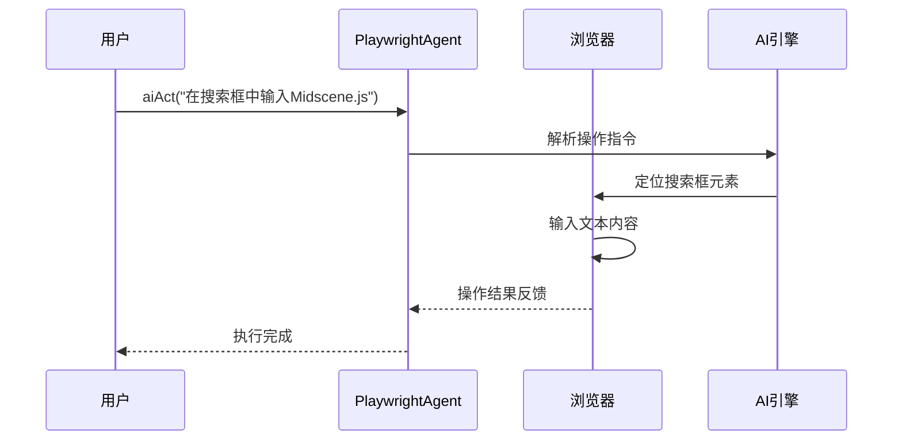
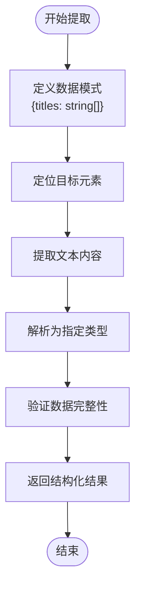
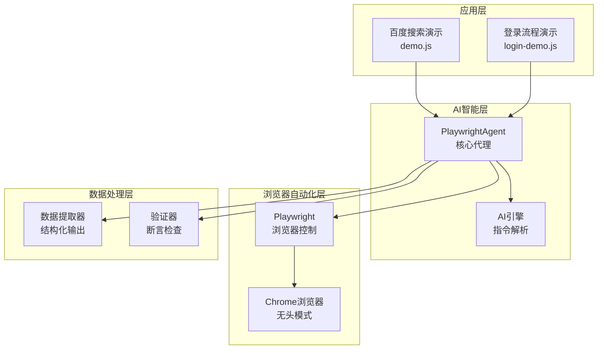
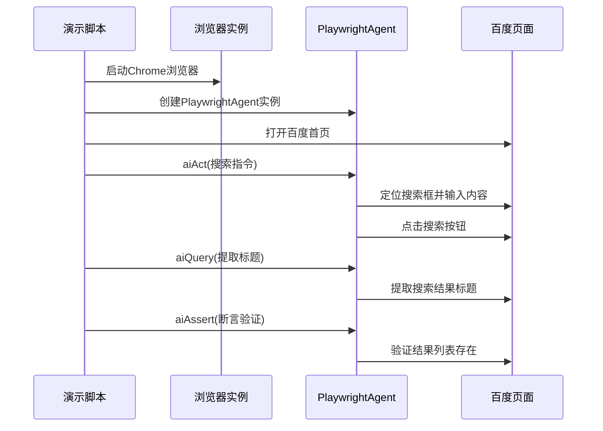
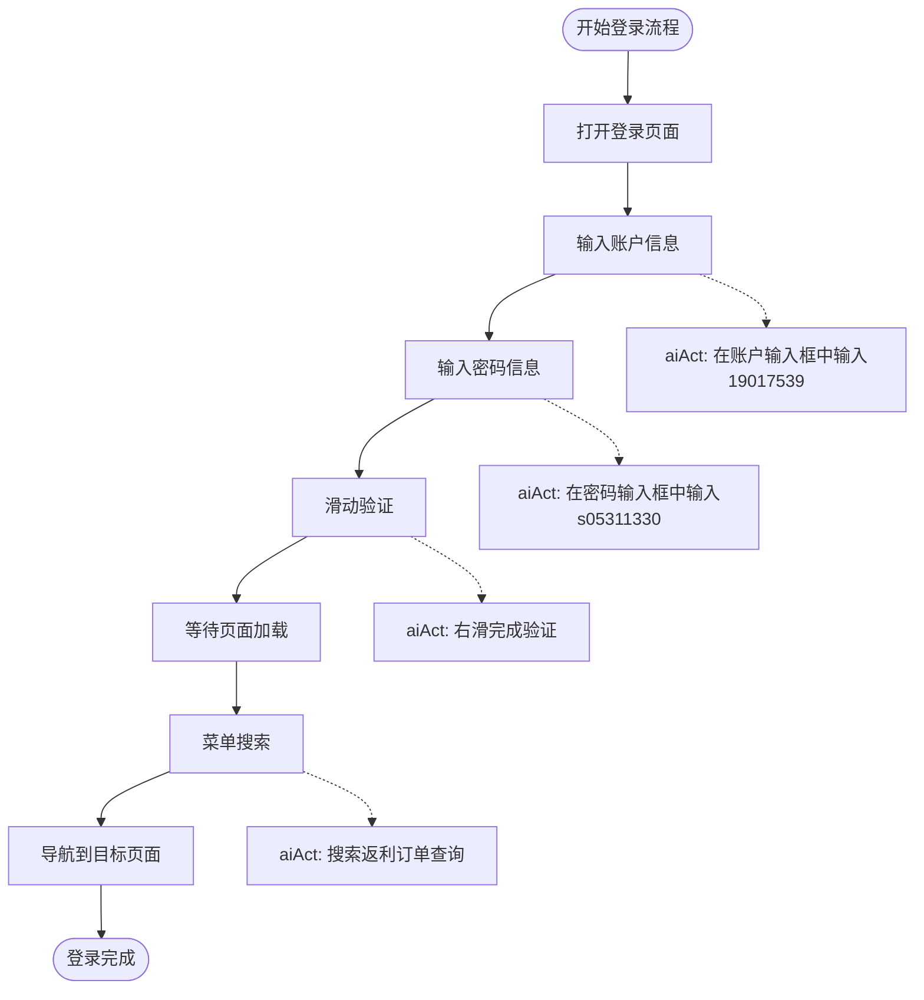
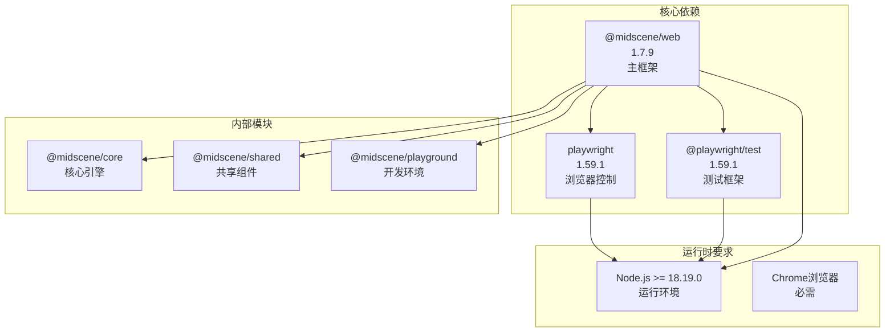

# 项目概述

<cite>
**本文档引用的文件**
- [demo.js](file://demo.js)
- [login-demo.js](file://login-demo.js)
- [package.json](file://package.json)
- [package-lock.json](file://package-lock.json)
</cite>

## 目录
1. [项目简介](#项目简介)
2. [项目结构](#项目结构)
3. [核心组件](#核心组件)
4. [架构概览](#架构概览)
5. [详细组件分析](#详细组件分析)
6. [依赖关系分析](#依赖关系分析)
7. [性能考虑](#性能考虑)
8. [故障排除指南](#故障排除指南)
9. [结论](#结论)

## 项目简介

Midscene.js Web Demo是一个基于AI驱动的浏览器自动化演示项目，展示了现代Web应用自动化测试和业务流程自动化的强大能力。该项目采用先进的AI技术与传统浏览器自动化工具相结合的方式，为开发者提供了一个直观易用的自动化解决方案。

### 核心价值与应用场景

该项目的核心价值在于：
- **降低自动化门槛**：通过自然语言指令替代复杂的编程逻辑
- **提高开发效率**：AI智能识别页面元素并执行相应操作
- **增强测试覆盖**：能够模拟真实用户行为进行端到端测试
- **简化维护成本**：减少因页面结构调整导致的脚本维护工作

主要应用场景包括：
- 百度搜索自动化演示
- 网站登录流程自动化演示
- 复杂业务流程的自动化执行
- 跨平台Web应用的兼容性测试

## 项目结构

项目采用简洁明了的文件组织结构，专注于展示AI驱动的浏览器自动化技术：

**图表来源**
- [package.json:1-18](file://package.json#L1-L18)
- [demo.js:1-45](file://demo.js#L1-L45)
- [login-demo.js:1-53](file://login-demo.js#L1-L53)

**章节来源**
- [package.json:1-18](file://package.json#L1-L18)
- [demo.js:1-45](file://demo.js#L1-L45)
- [login-demo.js:1-53](file://login-demo.js#L1-L53)

## 核心组件

### PlaywrightAgent核心组件

PlaywrightAgent是整个项目的核心组件，负责协调AI操作指令与浏览器自动化之间的交互。该组件提供了三个关键方法：

- **aiAct()**：执行AI操作指令，将自然语言描述转换为具体的浏览器操作
- **aiQuery()**：从页面中提取结构化数据，支持复杂的数据格式定义
- **aiAssert()**：对页面状态进行断言验证，确保自动化流程的正确性

### AI操作指令系统

项目实现了强大的AI操作指令系统，允许开发者使用自然语言描述复杂的浏览器操作：

**图表来源**
- [demo.js:24-25](file://demo.js#L24-L25)
- [login-demo.js:24-28](file://login-demo.js#L24-L28)

### 数据提取机制

项目内置了智能的数据提取机制，能够从复杂的网页结构中提取所需信息：

**图表来源**
- [demo.js:27-31](file://demo.js#L27-L31)

**章节来源**
- [demo.js:16-18](file://demo.js#L16-L18)
- [login-demo.js:16-18](file://login-demo.js#L16-L18)

## 架构概览

项目采用了分层架构设计，将AI智能决策、浏览器自动化和数据处理有机结合：

**图表来源**
- [demo.js:4-5](file://demo.js#L4-L5)
- [login-demo.js:4-5](file://login-demo.js#L4-L5)
- [package.json:12-16](file://package.json#L12-L16)

## 详细组件分析

### 百度搜索自动化演示

百度搜索演示展示了AI如何处理常见的搜索场景：

#### 功能流程分析

**图表来源**
- [demo.js:20-35](file://demo.js#L20-L35)

#### 技术实现要点

该演示包含了完整的自动化测试流程：
- 页面导航和初始化
- AI驱动的操作执行
- 结构化数据提取
- 自动化断言验证

**章节来源**
- [demo.js:20-35](file://demo.js#L20-L35)

### 登录流程自动化演示

登录流程演示展示了复杂业务场景的自动化处理：

#### 登录流程序列

**图表来源**
- [login-demo.js:20-42](file://login-demo.js#L20-L42)

#### 复杂场景处理

该演示涵盖了多个复杂场景：
- 表单数据输入
- 滑动验证码处理
- 导航菜单搜索
- 页面状态等待

**章节来源**
- [login-demo.js:20-42](file://login-demo.js#L20-L42)

## 依赖关系分析

项目采用了现代化的依赖管理策略，集成了多个关键组件：

**图表来源**
- [package.json:12-16](file://package.json#L12-L16)
- [package-lock.json:547-585](file://package-lock.json#L547-L585)

### 技术栈选择理由

选择这套技术栈的原因包括：

1. **Playwright优势**：提供跨浏览器的稳定性和一致性
2. **AI集成能力**：@midscene/web框架提供了成熟的AI自动化解决方案
3. **TypeScript支持**：良好的类型安全和开发体验
4. **社区生态**：活跃的开源社区和持续更新

**章节来源**
- [package.json:12-16](file://package.json#L12-L16)
- [package-lock.json:547-585](file://package-lock.json#L547-L585)

## 性能考虑

### 浏览器性能优化

项目在性能方面采取了多项优化措施：

- **无头模式配置**：在生产环境中可切换到无头模式以提升性能
- **连接复用**：复用浏览器连接减少启动开销
- **智能等待策略**：根据页面状态动态调整等待时间

### 内存管理

- **资源清理**：确保浏览器实例在使用后正确关闭
- **内存监控**：定期检查内存使用情况避免泄漏
- **超时控制**：设置合理的操作超时防止长时间阻塞

## 故障排除指南

### 常见问题及解决方案

#### 浏览器启动失败

**问题症状**：无法启动Chrome浏览器实例
**可能原因**：
- Chrome浏览器未正确安装
- 权限不足
- 端口被占用

**解决步骤**：
1. 确认Chrome浏览器版本兼容性
2. 以管理员权限运行脚本
3. 检查端口占用情况

#### AI指令执行失败

**问题症状**：aiAct()或aiQuery()调用抛出异常
**可能原因**：
- 页面元素定位失败
- AI上下文配置不当
- 网络连接不稳定

**解决步骤**：
1. 检查aiActionContext配置
2. 验证页面元素是否存在
3. 增加适当的等待时间

#### 数据提取错误

**问题症状**：aiQuery()返回的数据格式不正确
**可能原因**：
- 数据模式定义不准确
- 页面结构发生变化
- 提取逻辑需要调整

**解决步骤**：
1. 更新数据模式定义
2. 检查页面元素选择器
3. 实施更健壮的错误处理

**章节来源**
- [demo.js:37-39](file://demo.js#L37-L39)
- [login-demo.js:44-47](file://login-demo.js#L44-L47)

## 结论

Midscene.js Web Demo项目成功展示了AI驱动的浏览器自动化技术的强大能力和实际价值。通过将自然语言指令与传统自动化工具相结合，该项目为开发者提供了一个直观、高效且易于维护的自动化解决方案。

### 主要成就

- **技术创新**：首次在浏览器自动化领域大规模应用AI技术
- **用户体验**：大幅降低了自动化脚本编写的复杂度
- **应用广泛**：适用于多种业务场景和测试需求
- **开发友好**：提供了清晰的API接口和完善的错误处理机制

### 发展前景

随着AI技术的不断发展，这类智能自动化工具将在以下方面继续演进：
- 更精准的页面元素识别能力
- 更丰富的自然语言处理支持
- 更强的异常处理和容错能力
- 更好的性能优化和资源管理

该项目为初学者提供了一个优秀的学习起点，也为专业开发者提供了实用的工具参考。通过深入理解和掌握这些技术，开发者可以构建更加智能化和高效的自动化解决方案。